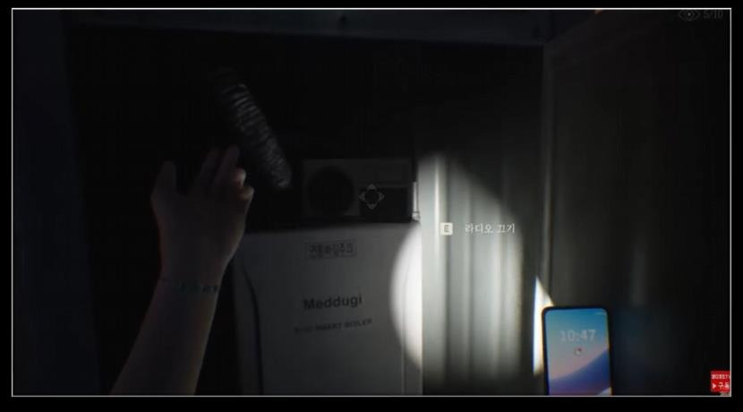
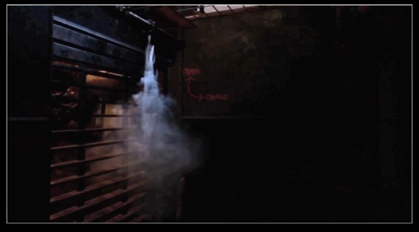
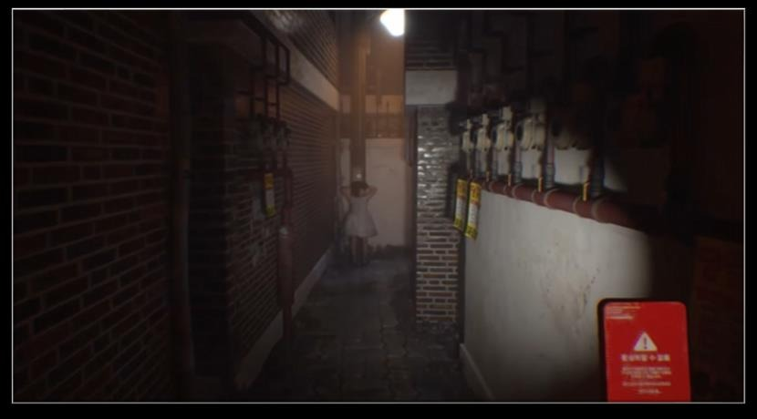

공포 게임의 몰입감은 사운드와 시퀀스가 게임플레이와 같은 타이밍으로 연결될 때 커진다.

사운드 경험:

- MetaSound 도입으로 Blueprint에 집중된 오디오 로직 분산
- 3D 공간 음향과 계층화된 사운드 설계
- Attenuation 세분화와 Curve 조정 구조
- AnimNotify로 시청각 타이밍 일치
- Sound Class 계층을 UI 옵션과 연동

시퀀스 경험:

- Sequencer Actor를 활용한 인게임 연출
- 특정 레벨에 종속되지 않는 범용 연출 시스템
- Event Track으로 퍼즐 기믹과 사운드 재생 연결
- 연출용 Actor를 동적으로 생성하고 실행
- 퍼즐 해결 보상 연출을 표준화

시퀀스는 컷신이 아니라 게임 상태를 바꾸는 연출 시스템으로 다뤄야 한다.

포트폴리오에서는 Occlusion을 활용한 폐쇄 공간 사운드와 Sequencer 기반 연출을 함께 확인할 수 있습니다. MetaSound와 Attenuation을 적용한 사운드 구현은 유저와 리뷰어의 긍정적인 평가로 이어졌고, 사운드 수정 시간도 줄였습니다.

관련 노트: [[game-options-localization]], [[interaction-component-architecture]], [[unreal-client-programming]]
