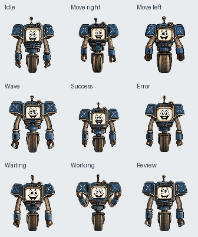
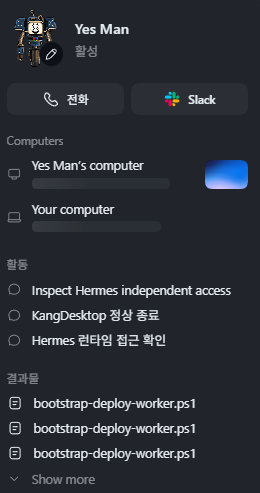

Codex에 Dot이 추가되면서 나만의 펫을 만들어봤다. 캐릭터는 좋아하는 폴아웃 시리즈의 **Fallout: New Vegas에 등장하는 Yes Man**으로 골랐다. 항상 웃고 있는 로봇을 코딩 동료로 두면 잘 어울리겠다는 생각이었다.

제작은 Codex와 함께 진행했다. 참고 이미지와 원하는 외형, 동작을 설명하고 이미지 생성부터 애니메이션 제작, 펫 등록까지 맡겼다. 특히 웃는 CRT 얼굴과 외바퀴, 기계 팔, 안테나를 유지해 작은 크기에서도 Yes Man으로 알아볼 수 있도록 요청했다.

동작에도 캐릭터의 성격을 반영했다. 대기할 때는 가볍게 움직이고, 작업할 때는 신나게 팔을 움직인다. 성공하면 팔을 들고 뛰며, 오류가 나면 CRT 화면에 잠깐 글리치가 나타난 뒤 다시 웃는 모습으로 돌아온다. 총 9가지 동작과 16방향 시선 프레임을 제작했다.

제작 중에는 팔과 안테나가 잘리거나 동작마다 몸체 크기가 달라지는 문제가 있었다. Codex가 미리보기와 프레임을 검사하며 해당 부분을 수정했고, 투명 배경과 프레임 정렬도 확인했다. 작은 화면에서 표정이 읽히는지, 이동 중에도 웃는 얼굴이 보이는지가 중요한 기준이었다.

완성한 펫은 Codex 계정에 등록하고 활성화했다. 설정 화면에서 Yes Man이 선택되는 것과 Idle 애니메이션 재생까지 확인했다.

평소 Codex에는 게임 구현과 검증을 주로 맡겼는데, 이번에는 내가 좋아하는 캐릭터를 작업 환경에 들여오는 데 사용했다. 참고 자료와 원하는 모습을 설명하는 것에서 시작해, 실제로 선택할 수 있는 커스텀 펫까지 만들어본 경험이었다.

[Yes Man 펫 제작 과정 전체 보기](https://chatgpt.com/s/cx_6abf89253b348191a9ca7130c22ac192)
