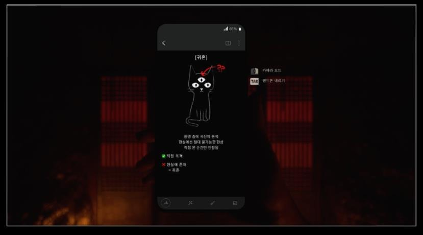
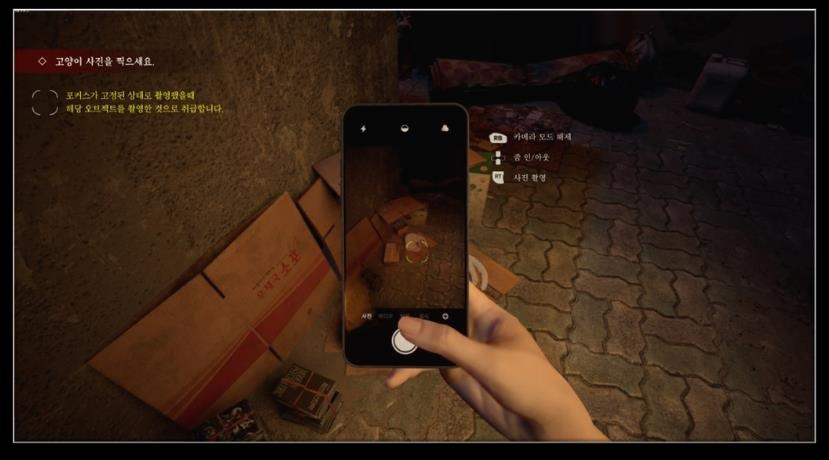

저는 Common UI를 화면 구성 도구가 아니라 입력 장치가 바뀌어도 플레이어가 다음 행동을 잃지 않게 만드는 구조로 사용했다. 컨트롤러·키보드·마우스 전환과 레이어 이동에서 포커스가 유지되는지를 구현 기준으로 삼았다.

경력기술서 기준 경험:

- Common UI Plugin 도입
- Action Bar 기반 Hot Key 기능
- Widget 레이어 관리
- 포커스 유실을 줄이는 UI 흐름 설계
- Widget Animation을 통한 정보 전달
- 입력 장치 변경을 실시간 감지
- PC/Xbox 등 입력 장치에 맞는 UI 표기 전환

Widget Navigation만으로 복잡한 UI 포커스를 관리하면 포커싱이 끊길 수 있다. 그래서 레이어와 Action Bar를 함께 설계해 입력 장치 전환 시에도 UI 상태와 안내가 같은 흐름을 유지하도록 구성했다.

포트폴리오에서 확인되는 결과:

- PC와 Xbox 입력 장치 전환에 맞춰 스마트폰 UI와 Action Bar 표시를 바꾸고, 포커스 유실 문제를 줄였습니다.

관련 노트: [[unreal-client-programming]], [[game-options-localization]]
