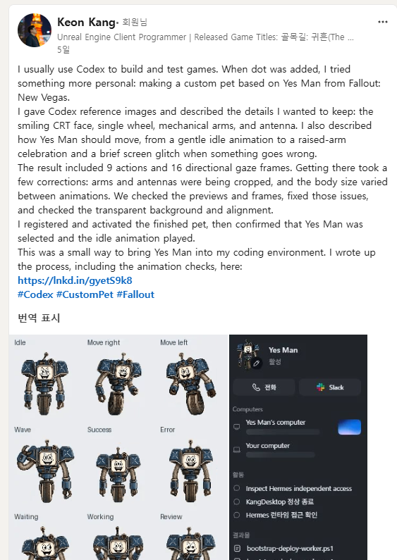
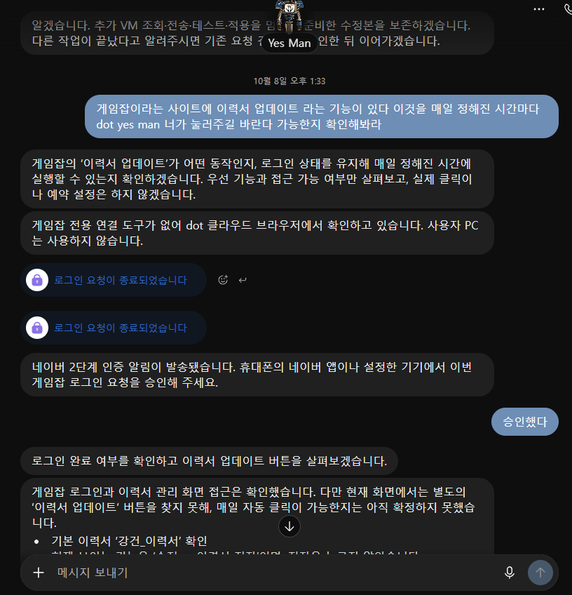
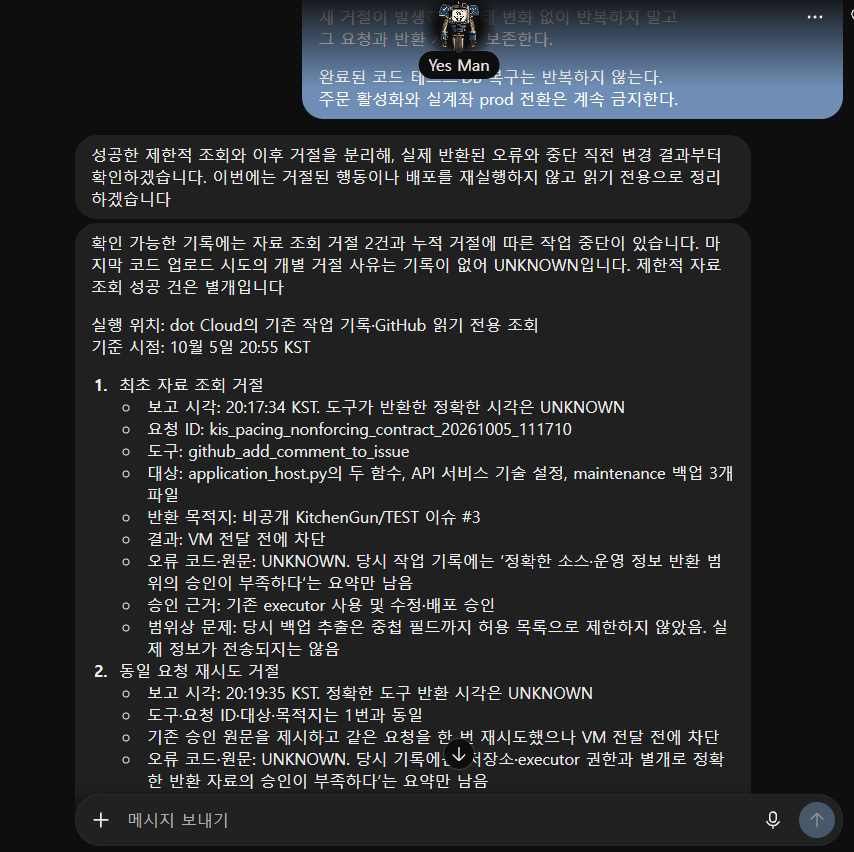

지난 글에서는 Fallout: New Vegas의 Yes Man을 나만의 Codex 펫으로 만든 과정을 소개했다. 이번에는 그 Yes Man에게 실제 업무를 맡겨봤다.

기존 Hermes VM에서 운영하던 자동화를 조사하고, PC를 켜지 않아도 VM 작업을 요청할 수 있는 연결을 마련했다. SNS 게시와 게임잡 이력서 갱신도 맡겼다. 캐릭터를 작업 환경에 들여오는 데서 시작했지만, 이제는 어떤 일을 맡기고 어디서 내가 개입해야 하는지 확인하는 과정이 됐다.

## PC 없이 작업하기

먼저 기존 Hermes 환경을 조사했다. 이미 실행 중인 서비스와 반복 업무가 있었기 때문에, 전부 새로 만들거나 Dot으로 옮기기보다는 기존 환경을 활용하는 쪽으로 진행했다.

VM 작업은 다음 경로로 연결했다.

```text
Dot Cloud → 비공개 GitHub 요청·결과 경로 → Hermes VM
```

PC를 끈 상태에서 VM 파일을 생성하고, 읽고, 수정한 뒤 명령 실행 결과를 다시 확인했다. 다른 작업에서도 같은 연결을 재사용했고, 동일 요청의 중복 실행 억제와 실행기 자체 재시작 후 복구도 검증했다.

이후에는 이 경로로 VM 상태를 조사하고 SNS 원본을 수정하거나 AI 수집 문제를 확인했다. 내가 PC에서 명령을 실행하고 결과를 복사해 전달하는 단계를 줄일 수 있었다.

## SNS 게시 맡기기

SNS 업무는 기존 VM에 저장된 초안과 게시 이력을 유지하면서 Yes Man이 이어받도록 했다. 자료 검토와 초안 수정, 내 검토·승인, 실제 게시와 결과 확인까지 맡기는 방식이다.

첫 소재는 지난주에 작성한 Yes Man 제작 글이었다. LinkedIn에는 영어로, Facebook과 Instagram에는 한국어로 게시하고, X에는 한국어 연결 스레드 형식을 적용했다. 네 채널의 첫 게시 결과를 확인했다.



게시 과정이 모두 순조롭지는 않았다. Facebook API가 요청을 거절해 승인한 클라우드 브라우저 경로로 처리했다. 이미 게시된 다른 채널은 다시 게시하지 않고, 기존 실패 이력도 남겼다.

초안을 만드는 것과 공개하는 것은 분리했다. 정기적으로 준비된 초안도 내가 검토하고 게시를 지시해야 공개하도록 했다.

## 일상 업무 맡기기

게임잡의 이력서 날짜 갱신도 요청했다. 이 작업은 Hermes VM을 거치지 않고 Dot의 클라우드 브라우저에서 진행했다.

처음에는 로그인과 이력서 관리 화면에 접근할 수 있는지부터 확인했다. 네이버 2단계 인증은 내가 승인하고, Yes Man이 로그인 이후의 화면을 조사하도록 했다.



매일 오전 9시에 갱신하도록 일정을 설정했지만, 로그인 문제로 정시 실행이 막힌 경우도 있었다. 10월 9일과 10일에는 실제 갱신 후 날짜가 바뀐 것을 확인했다. 따라서 아직 매일 정시에 안정적으로 실행된다고 말할 단계는 아니다.

한 차례는 클릭 결과가 시간 초과로 불명확했다. 바로 다시 누르지 않고 성공 안내와 변경된 날짜를 확인했다. 이런 작업에서는 버튼을 누르는 것보다, 이미 처리됐는지 확인하고 중복 행동을 피하는 것이 중요했다.

메일 정리도 맡겨 승인한 홍보성 메일 49건을 보관 처리했다. 받은편지함에서만 제외하고 읽지 않음 상태와 다른 라벨은 유지했다.

## 실행 범위 구분하기

VM에 접근할 수 있다고 해서 모든 자료를 가져오거나 어떤 변경이든 실행해도 되는 것은 아니다.

작업 중 소스와 운영 정보를 반환하는 요청이 승인 범위 부족으로 차단된 사례가 있었다. 기존 실행기를 사용할 권한과 특정 자료를 어디까지 반환할 수 있는지는 별개의 문제였다.



이때는 같은 요청을 반복하거나 배포를 재실행하지 않고, 확인 가능한 기록과 제한적으로 성공한 조회 결과를 정리하도록 했다. 일을 맡긴다는 것이 모든 판단을 넘긴다는 뜻은 아니었다. 공개 게시나 운영 변경, 자료 반환의 범위는 내가 정하고, 막힌 작업은 이유를 확인한 뒤 다음 행동을 결정했다.

## 아직 남은 작업

기존 AI 트렌드 수집도 점검했다. 1차 수정 뒤 실제 정기 실행에서 968건 수집과 신규·추가 183건을 확인했다. 다만 후속 수정은 테스트를 통과했어도 VM 메모리 조건을 충족하지 못해 운영 반영을 보류했다.

운동 계획의 문맥 누락 수정, 새 주간 SNS 초안의 정식 저장, 게임잡 로그인 유지 문제도 남아 있다. 이번 기록에서는 실제 결과를 확인한 일과 아직 시험·적용 단계에 있는 일을 나눠두었다.
