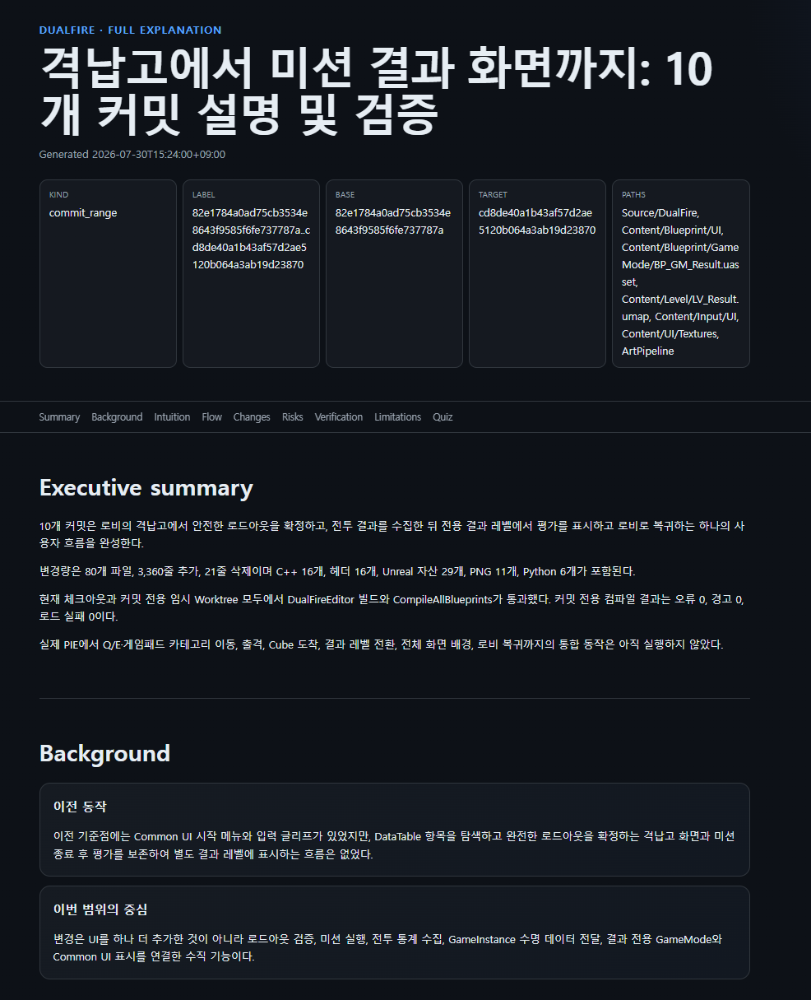
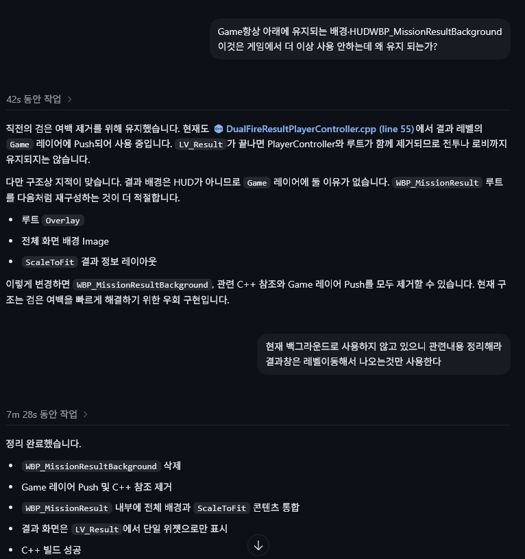

AI에게 기능 구현을 맡기면 변경량은 빠르게 늘어난다. 하지만 여러 시스템과 에셋을 한 번에 건드린 결과를 내가 충분히 이해하기 전에 다음 작업으로 넘어가면, 의도에서 벗어난 구조를 늦게 발견하기 쉽다. DualFire에서는 이 문제를 줄이기 위해 커밋 범위를 읽을 수 있는 설명 페이지로 바꾸고, 그 페이지를 다시 내가 검토하는 흐름을 만들었다.

이 작업은 [Understanding is the new bottleneck](https://www.youtube.com/watch?v=WkBPX-oDMnA) 영상과 [Explain Diff Gist](https://gist.github.com/geoffreylitt/a29df1b5f9865506e8952488eac3d524)를 참고했다. 그대로 복제하지 않고, Unreal 프로젝트에서 필요한 빌드, Blueprint, 에셋 검증의 근거와 한계를 분리하도록 구현했다.

## 문제: 구현 속도와 이해 속도의 차이

격납고에서 전투를 시작하고, 결과 레벨에서 평가를 표시한 뒤 로비로 돌아오는 흐름은 C++, Blueprint, 레벨, Common UI, 입력, 이미지 에셋에 걸쳐 있다. 변경 파일 목록과 diff만으로는 이전 동작이 무엇이었고, 어떤 구조가 교체됐으며, 무엇을 아직 검증하지 못했는지 빠르게 파악하기 어렵다.

그래서 AI의 결과를 곧바로 신뢰하거나 다시 모든 코드를 처음부터 읽는 대신, **구현 범위를 설명 가능한 검토 단위로 압축하고 질문으로 되짚는 단계**를 추가했다.

## 선택: 읽기 전용 커밋 설명 페이지

`28bf72be36908661850ba70d6f4d8afeb3e0d054`에서 `explain-dualfire-change` 스킬을 추가했다. 이 스킬은 기능을 수정하거나 Unreal Editor를 조작하지 않는다. 선택한 커밋 범위와 검증 결과를 수집해 저장소 밖의 단일 HTML 보고서로 만들고, 보고서 자체도 오프라인에서 검증한다.

설명 페이지는 다음 순서로 구성했다.

```text
커밋 범위 확정
  -> 이전 동작과 변경 의도 정리
  -> 변경 파일과 위험을 연결
  -> 빌드 및 Blueprint 검증 결과 분리
  -> 아직 실행하지 않은 PIE 항목 명시
  -> 이해 확인 퀴즈로 검토
```



_격납고부터 미션 결과 화면까지의 10개 커밋을 설명하는 생성 결과. 범위, 변경 경로, 요약, 이전 동작, 리스크, 검증, 한계, 퀴즈를 한 페이지에서 확인한다._

이번 보고서에는 `82e1784..cd8de40` 범위의 10개 커밋을 넣었다. 격납고의 로드아웃 확정, 전투 결과 수집, 결과 레벨 표시, 로비 복귀를 하나의 사용자 흐름으로 설명한다. 80개 파일의 변경도 C++, Unreal 에셋, PNG, Python으로 구분해 보여 주므로, 변경량 자체보다 어떤 책임이 연결됐는지를 먼저 볼 수 있다.

## 보고서에서 확인하는 내용

### 이전 제작 내용과 교체된 구조

보고서는 "이전 동작"과 "이번 범위의 중심"을 분리한다. 예를 들어 결과 화면은 처음에 Common UI 시작 메뉴와 입력 클리어 흐름에 붙어 있었지만, 이번 범위에서는 로드아웃 확정부터 결과 평가와 로비 복귀까지 연결됐다. 단순히 새 화면을 추가한 것이 아니라, 어떤 데이터가 어느 시점에 유지되고 결과 화면으로 전달되는지까지 읽을 수 있게 정리한다.

### 리스크와 검증의 분리

검증 결과는 통과한 것과 아직 확인하지 못한 것을 섞지 않는다. 이 범위에서는 임시 Worktree의 `DualFireEditor` 빌드와 `CompileAllBlueprints`가 통과했고, 컴파일 결과는 오류 0, 경고 0, 로드 실패 0이었다. 반면 실제 PIE에서 키보드와 게임패드 이동, 전투 종료, 결과 레벨 전환, 로비 복귀까지의 통합 동작은 실행하지 않았으므로 `not_run`으로 남겼다.

이 구분은 "빌드가 통과했으니 플레이도 맞다"는 결론을 막는다. 보고서는 피격 수 중복 집계 가능성, 전역 Slate 탐색 규칙의 복원 책임, 레벨 전환 실패 시 재시도 상태처럼 이후에 확인할 리스크도 함께 남긴다.

### 퀴즈로 이해 확인

마지막에는 5개의 선택형 질문을 넣었다. 예를 들어 로드아웃을 선택한 즉시 활성 데이터에 쓰지 않는 이유, 결과 레벨 전환 뒤 데이터를 유지하는 객체, 아직 증명되지 않은 통합 동작을 질문한다. 페이지를 읽고 끝내는 대신, 변경의 경계와 남은 검증 항목을 내가 다시 답하게 하는 장치다.

## 실제로 발견한 중복 기능

이 검토 흐름은 결과 UI의 중복 구조를 초기에 찾는 데 사용했다. 결과 화면이 전용 레벨 `LV_Result`에서 표시되는데도, 이전의 `WBP_MissionResultBackground`가 `Game` 레이어로 Push되고 있었다. 화면 배경이 두 경로에 존재하면 나중에 레이아웃과 수명 주기를 추적할 때 흐름을 놓칠 가능성이 커진다.



_기존 배경 Widget의 사용 위치를 질문한 뒤, 전용 배경 에셋과 Game 레이어 Push를 제거하고 결과 Widget 내부 구조로 통합한 기록._

후속 커밋 `e1f79ee`에서 별도 `WBP_MissionResultBackground`를 삭제했다. 전체 배경 Image와 `ScaleToFit` 결과 콘텐츠는 `WBP_MissionResult`의 Root Overlay 안으로 통합했고, `DualFireResultPlayerController`의 `Game` 레이어 Push와 관련 C++ 참조도 제거했다. 결과 화면은 `LV_Result`에서 단일 Widget으로 표시하는 구조가 됐다.

이 사례에서 중요한 점은 AI가 중복을 자동으로 고쳤다는 주장이 아니다. 생성된 설명 페이지가 시스템 경계와 위험을 읽을 수 있는 형태로 정리해 주었고, 내가 "왜 이 배경이 아직 Game 레이어에 있는가"를 초기에 질문할 수 있었다는 점이다. 그 결과, 흐름이 더 복잡해진 뒤에 원인을 찾는 대신 중복 기능을 작은 정리 커밋으로 분리했다.

## 검증과 경계

- 보고서는 외부 스크립트, 스타일시트, 이미지를 불러오지 않는 단일 HTML로 생성하고 구조와 퀴즈 데이터를 검증했다.
- 커밋 범위의 빌드, Blueprint 컴파일, 에셋 점검은 각각 별도 결과로 기록했다.
- 실제 플레이 경험은 PIE 실행으로만 확인할 수 있다. 이번 설명 보고서는 정적 근거와 헤드리스 검증을 정리한 것이며, 통합 플레이 검증을 대체하지 않는다.
- Unreal MCP가 현재 세션에 연결되어 있지 않은 경우에는 WBP Tree나 Event Graph의 전후 구조를 실행 중 Editor에서 증명했다고 쓰지 않는다.

바이브 코딩에서 필요한 것은 AI가 만든 파일을 모두 외우는 일이 아니라, 내가 다음 결정을 내릴 수 있는 속도로 결과를 다시 이해하는 일이다. 이 워크플로우는 변경 의도, 실제 교체, 검증된 사실, 남은 위험을 한 화면으로 모으고, 마지막 질문으로 내 이해를 확인하게 만든다. 그래서 구현이 내 의도에서 벗어나는 신호를 더 이른 시점에 잡을 수 있다.
