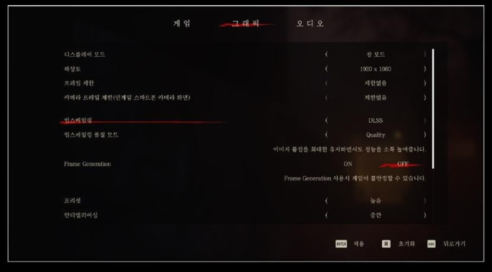
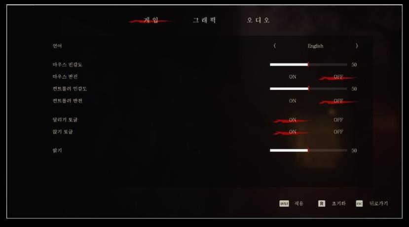
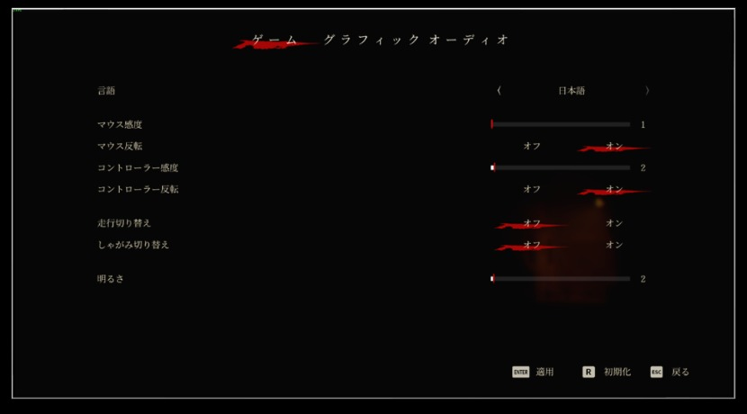
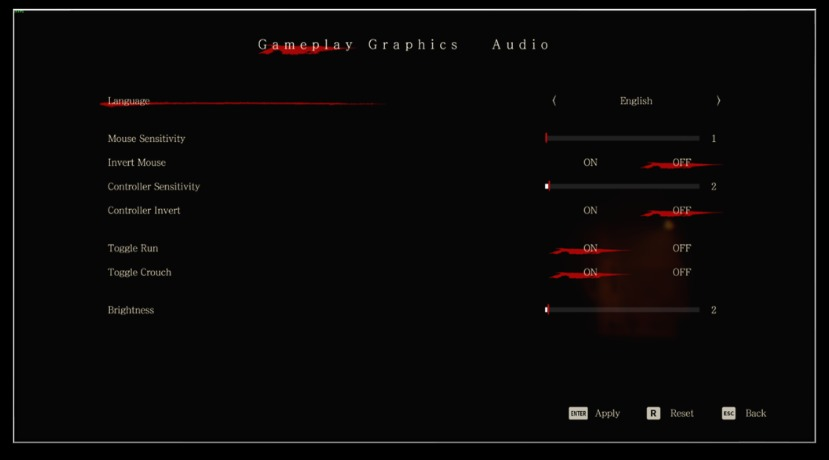

옵션과 현지화는 출시 품질에 직접 연결되는 클라이언트 작업이다.

옵션 경험:

- Custom GameUserSettings 구현
- DLSS 3.5 / FSR 3 플러그인 통합
- 하드웨어 정보를 분석해 지원 여부 자동 식별
- Virtual Texture 같은 프로젝트 특화 옵션 구현
- Game Instance Subsystem을 활용한 세이브 데이터 로드
- 프리셋 제공으로 옵션 조작 편의성 개선

현지화 경험:

- String Table 도입으로 중복 번역과 오번역 위험 완화
- 언어별 Font Family 제작
- 텍스트가 포함된 Material/Texture를 언어별로 로드
- LQA 과정의 `.po` 파일과 데이터 교체 대응

옵션은 기능 구현보다 저장, 적용 시점, 재시작 필요 여부, 플랫폼별 지원 범위를 명확히 나누는 것이 중요하다.

포트폴리오에 기록된 성능 개선:

- RTX 2080 Ti와 4K 환경 테스트에서 DLSS/FSR 적용 후 평균 45fps를 75fps까지 높여 약 66%의 성능 향상을 달성했습니다.
- String Table과 언어별 Font Family 및 Material/Texture 로딩으로 다국어 출시 환경을 구성했습니다.

관련 노트: [[unreal-client-programming]], [[common-ui-workflow]], [[audio-visual-sequencer]]
