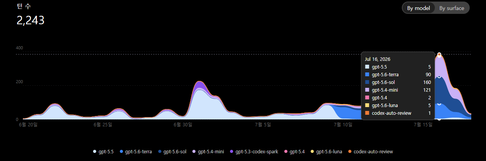

GPT-5.6가 공개된 뒤 제 작업량이 늘었다는 인상을 GitHub 커밋 수와 함께 확인했다. 다만 모델 출시가 커밋 증가의 원인이라고 단정하지는 않는다. 이 글은 여러 모델을 동시에 활용한 운영 정책과, 그 시점에 함께 관찰된 커밋 흐름을 분리해 기록한 작업 노트다.

OpenAI는 2026년 7월 9일 GPT-5.6 Sol, Terra, Luna를 ChatGPT, Codex, API에 공개했다. 이 글에서 릴리스 정보는 공식 문서에 적힌 모델명, 날짜, 사용 범위로만 다룬다. 로컬 라우팅 설정은 역할 배정 정책의 근거일 뿐, 모델의 일반 성능이나 가용성을 증명하지 않는다.

- [GPT-5.6 출시 안내](https://openai.com/index/gpt-5-6/)
- [GPT-5.6의 ChatGPT/Codex 사용 가능 범위](https://help.openai.com/en/articles/20001354-gpt-56-in-chatgpt)

## 관찰한 커밋 흐름

사용량 그래프에서 GPT-5.6 계열 사용이 뚜렷하게 늘어난 7월 15일을 기준으로, 그 전후의 완료된 4일을 비교했다. GitHub 기여로 집계되는 커밋 수는 7월 11일~14일 3건, 7월 15일~18일 11건이었다. 하루 평균으로는 0.75건에서 2.75건으로 약 3.7배가 됐다.



_7월 16일 사용량 상세. 한 작업을 하나의 모델에 몰지 않고, GPT-5.6 Sol·Terra·Luna와 보조 모델을 역할별로 함께 사용한 기록이다._

이 수치는 생산성의 완전한 지표가 아니다. GitHub 커밋에는 병합 커밋도 포함되고, 코드 줄 수·문제 난이도·검토 시간·실패한 실험은 반영되지 않는다. 비교 기간도 짧다. 따라서 여기서의 결론은 **병렬 에이전트 운영 시기와 커밋 빈도 증가가 함께 관찰됐다**는 수준으로 제한한다.

## 릴리스와 변경을 연결하는 기록

릴리스 소식이 곧바로 구현 효과를 뜻하지 않도록, 작업마다 다음 정보를 같은 단위로 남긴다.

```text
공식 릴리스 URL / 발행일
  -> 검토한 기능 가설
  -> 작업 범위와 커밋 SHA
  -> 구현 결과
  -> 독립 리뷰
  -> 사람 승인과 공개 여부
```

커밋 수는 이 연결을 여는 보조 지표다. 동일 기간에 어떤 작업이 늘었는지는 확인할 수 있지만, 특정 모델이 특정 변경의 품질을 높였다는 결론은 같은 과제와 기준선이 있는 통제된 비교가 있어야만 낼 수 있다.

## 역할을 모델이 아니라 작업 경계로 나누기

이 운영 시점의 로컬 정책은 루트 모델을 Sol로 두고, 병렬 서브에이전트 수는 최대 4개, 깊이는 1단계로 제한했다. 에이전트를 재귀적으로 늘리는 대신, 각 결과는 통합 담당자에게 돌아오게 했다.

| 역할 | 사용 범위 | 경계 |
| --- | --- | --- |
| Sol | 작업 분해, 최종 통합, 병합, 완료 판정 | 목표와 완료 조건을 바꾸는 판단은 여기에서만 한다. |
| Terra | 구현, 조사, 도구 사용, 다중 파일 디버깅 | 설계 또는 범위 판단이 불명확하면 Sol로 올린다. |
| Luna | 추출, 분류, 스캔, 반복 변환, 정형 요약 | 요구사항 해석이나 파일 관계 판단은 맡기지 않는다. |
| Mini Explorer | 빠른 검색, 파일 맵, 테스트 후보 정리 | 읽기 전용이며 구현 결정을 하지 않는다. |
| Terra Reviewer | 독립 검토 | 읽기 전용으로 `PASS`, `REWORK`, `BLOCKED`만 반환한다. |

이 표는 현재 설정을 설명하는 운영 정책이다. 모든 세션이 같은 역할 분리를 실행했다는 증거로 사용하지 않는다. 핵심은 모델 수가 아니라 쓰기 권한과 판단 권한을 분리하는 데 있다.

## 실제 작업 흐름

반복적이고 독립적인 탐색은 Luna와 Mini Explorer에 먼저 보낸다. 파일 목록, 로그 분류, 테스트 후보, 공개 문서 형식 점검처럼 정해진 출력이 필요한 작업이 대상이다. Terra는 그 결과를 바탕으로 구현과 도구 호출을 맡고, 별도의 Terra Reviewer가 변경 내용을 읽기 전용으로 확인한다. Sol은 충돌 가능성이 있는 판단, 최종 검증, 커밋과 푸시를 담당한다.

구현자와 검토자를 같은 에이전트에게 맡기지 않고, 같은 파일을 여러 에이전트가 동시에 고치지 않는다. 공개 후보가 자동으로 생성되더라도, 위험 검사와 콘텐츠 검증, 독립 검토, 사람 승인을 통과한 경우에만 공개 결과로 전환한다.

이 방식은 [[personal-hermes-agent]]의 Job Registry처럼 실행 단위를 분리하는 원칙과 연결된다. Hermes는 [[hermes-daily-dev-brief]]와 [[hermes-game-jobs-pipeline]]에서 반복 업무를 정규화하고 보고하는 데 쓰고, Codex 병렬 운영은 하나의 개발 작업 안에서 탐색·구현·검토를 분리하는 데 쓴다. 공개와 비공개 기록의 경계는 [[llm-wiki-memory-architecture]]의 원칙을 따른다. [[unreal-uasset-text-diff]]처럼 변경을 사람이 읽을 수 있는 근거로 남기는 작업도 이 검토 흐름에 맞춘다.

## 검증 기준과 한계

- 각 서브에이전트는 자기 출력과 수정 범위를 명시한다.
- 구현과 독립 검토는 같은 에이전트에게 맡기지 않는다.
- 최종 통합 전에는 테스트, 빌드, 변경 파일 목록을 확인한다.
- 커밋 수는 작업량의 보조 지표일 뿐이고, 릴리스 효과나 개인 생산성의 인과 근거로 사용하지 않는다.
- 모델별 역할은 현재 정책 기준이다. 모델 성능·가격·사용 가능 범위가 바뀌면 같은 규칙을 그대로 유지하지 않고 다시 점검한다.

이번 기록에서 확인한 것은 더 많은 모델을 붙이는 방법이 아니다. 반복 작업을 분리하고, 구현과 검토를 나누며, 최종 결정과 배포 책임을 한 곳에 남기는 방식이다. 자동화의 산출물은 결론 자체가 아니라, 사람이 검토하고 승인할 수 있는 입력이어야 한다.
