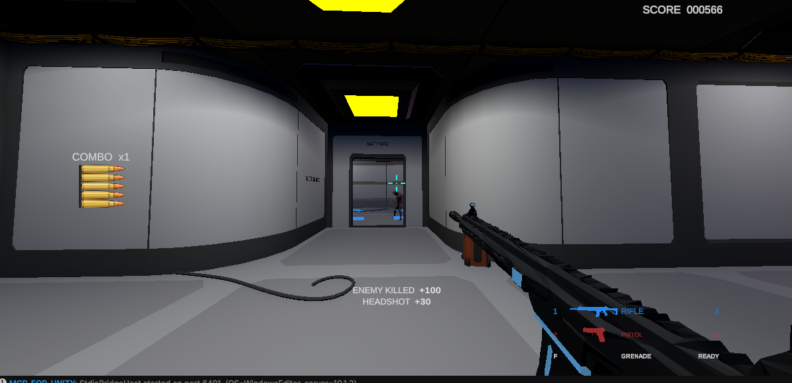
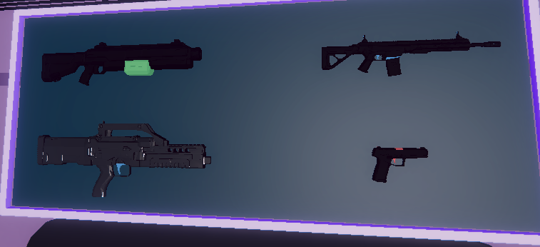

[OpenAI Game Builders Seoul](https://www.openaigame2026.com/#main)에 참가하기 위해 약 2주 동안 Unity WebGL 게임 `Gulag-project`를 개발했다.

이번 프로젝트의 목표는 AI를 보조 도구로 사용하는 수준을 넘어, 기획 이후의 제작 과정을 AI 에이전트와 연결해 실제로 플레이 가능한 게임을 완성하는 것이었다.

- [Gulag-project 플레이](https://kitchengun.github.io/wiki/games/gulag/)
- [GitHub 저장소](https://github.com/KitchenGun/Gulag-project)

## 문서 기반의 게임 설명

`Gulag-project`는 SF 배경의 아레나에서 세 클래스 중 하나를 선택하고, 적이 떨어뜨린 탄약을 회수하며 높은 점수에 도전하는 1인칭 생존 슈팅 게임이다.

플레이어는 척탄병, 공병, 저격수 중 하나를 선택한다.

- 척탄병: 라이플, 권총, 수류탄
- 공병: 샷건, 권총, 로켓 런처
- 저격수: DMR, 권총, 불릿타임

전장에는 자폭형, 근거리, 원거리 적이 함께 등장한다. 적을 처치하면 탄약이 사망 위치에 떨어지기 때문에 플레이어는 계속 이동하며 무기와 전투 위치를 선택해야 한다.

헤드샷, 연속 처치, 무기 전환과 클래스 스킬 활용은 점수와 콤보로 이어진다. 사망 후에는 점수, 생존 시간, 처치 기록을 확인하고 닉네임을 입력해 랭킹에 도전할 수 있다.



_Codex 에이전트와 Unity MCP로 구현하고 플레이테스트한 현재 WebGL 전투 화면._

## Codex와 함께 구현한 작업

8월 6일 Unity 프로젝트 환경을 구성한 뒤 현재까지 64개의 커밋을 통해 게임의 전체 흐름을 구현했다.

- 클래스 선택 로비와 조작 안내
- 1인칭 이동, 사격, 무기 전환과 반동
- 클래스별 고유 스킬
- 세 종류 적의 이동과 공격
- 탄약 드롭과 획득
- 피격, 회복과 사망
- 점수, 헤드샷과 콤보
- 결과 화면과 온라인 랭킹
- 시각 효과, 시스템 음성과 배경음악
- Unity WebGL 빌드와 공개 배포

내 역할은 게임의 기획과 구현 방향을 제시하는 것이었다. 실제 코드 작성, Unity Scene과 Prefab 수정, 반복 검증은 Codex 에이전트와 Unity MCP를 중심으로 진행했다.

Unity MCP를 통해 에이전트가 Unity Editor의 Scene, GameObject, Component와 Prefab을 직접 확인하고 수정했다. 레벨 디자인, 전투 시스템, UI 구성과 플레이테스트 역시 같은 흐름 안에서 반복했다.

기능을 구현한 뒤에는 Codex 에이전트가 실제 게임을 플레이하며 이동, 전투, 클래스 스킬, 사망, 결과와 재시작 흐름을 검증했다. 문제가 발견되면 코드나 Scene을 수정하고 다시 Play Mode에 진입하는 방식으로 구현과 테스트를 연결했다.

## AI 아트 에이전트와 제작한 게임 에셋

게임에 필요한 아트도 AI 기반으로 제작했다.

Codex 에이전트가 Meshy API를 제어해 게임의 방향에 맞는 콘셉트 아트를 만들고, 이를 기반으로 3D 모델과 애니메이션을 제작했다. 생성한 결과는 Unity에 가져와 Prefab과 Material로 구성하고 실제 게임 화면에서 다시 검토했다.



_Meshy API를 Codex로 제어해 제작하고 Unity 인게임에 적용한 권총, 샷건, 라이플과 DMR 모델._

이 과정은 아트 개발을 담당하는 별도의 에이전트를 고용한 것과 비슷한 경험이었다. 나는 필요한 적과 환경, 무기와 로비의 방향을 설명했고, Codex 에이전트는 다음 과정을 이어서 수행했다.

```text
기획과 시각 방향 제시
  -> 콘셉트 아트 생성
  -> Meshy API 기반 모델 제작
  -> 애니메이션 제작
  -> Unity 에셋 구성
  -> Scene 배치
  -> Play Mode 검증
```

코드, 레벨, UI뿐 아니라 콘셉트 아트와 모델링, 애니메이션까지 하나의 에이전트 작업 흐름으로 연결하면서 제작 속도를 크게 높일 수 있었다.

## AI로 제작 전반을 연결한 프로젝트

이번 프로젝트에서 내가 직접 담당한 것은 게임 기획과 구현 방향을 결정하는 일이었다.

어떤 게임을 만들지, 플레이어가 어떤 판단을 반복해야 하는지, 클래스와 적의 역할을 어떻게 나눌지를 정했다. 그 방향을 실제 코드와 에셋, 레벨과 WebGL 빌드로 변환하는 작업은 Codex 에이전트, Unity MCP와 Meshy API를 활용해 진행했다.

AI를 단순히 코드를 추천하는 도구로 사용하지 않고 다음 역할을 담당하는 제작 에이전트로 운용했다.

- 게임플레이 프로그래머
- 레벨 디자인 작업자
- Unity Editor 작업자
- 플레이테스트 및 검증 담당
- 콘셉트 아트와 3D 에셋 제작 담당
- WebGL 빌드와 배포 작업자

여러 제작 역할을 AI 에이전트에 연결해, 짧은 기간 안에 기획 문서에서 실제 브라우저 게임까지 도달하는 생산성을 확인한 프로젝트였다.

## 현재 버전과 제출 계획

현재 공개된 버전은 `0.1.4`다. [WebGL 실행 페이지](https://kitchengun.github.io/wiki/games/gulag/)에서 클래스 선택부터 전투, 사망, 결과와 재시작으로 이어지는 현재 플레이 흐름을 확인할 수 있다.

앞으로 밸런스와 레벨 디자인을 고도화하고, 디자이너가 제작한 사운드를 추가한 뒤 대회에 제출할 예정이다.

이번 2주는 AI가 게임 개발의 일부를 돕는 수준을 넘어, 기획을 실제 결과물로 변환하는 제작 파이프라인 전체에 참여할 수 있는지를 확인한 시간이었다. `Gulag-project`는 그 실험이 실제로 플레이할 수 있는 결과물까지 이어졌다는 기록이다.
