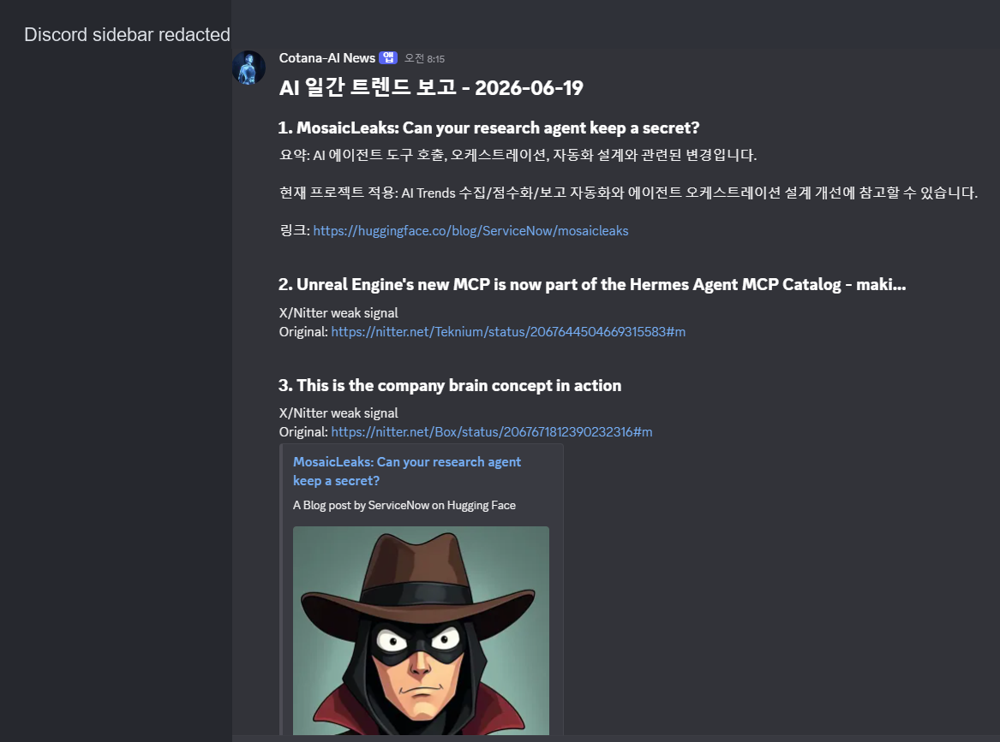

Hermes Daily Dev Brief는 매일 Hermes Agent로 AI 에이전트, MCP, 개발 도구, Unreal 자동화 관련 최신 정보를 수집하고 내 개발 환경에 맞는 적용 포인트까지 정리하는 자동화다.

공개용 캡처에서는 Discord 서버/채널 사이드바를 가렸다.

## 목표

- 일반 뉴스 목록이 아니라 `personal-hermes-agent`, Hermes Cron, Codex 작업 큐, [[unreal-mcp]] 실험에 바로 연결되는 개발 브리핑 생성
- 새 기능, 릴리스, 에이전트 오케스트레이션 변화, MCP 생태계 변화를 매일 같은 형식으로 축적
- X/Nitter 같은 빠른 신호는 약한 신호로만 다루고, 공식 RSS/릴리스/블로그 기반 근거를 우선 사용

## 사용자 흐름

1. Hermes Cron이 정해진 주기로 공개 소스를 수집한다.
2. 중복 제거 후 원본 행을 스프레드시트의 raw 영역에 추가한다.
3. Hermes 평가 단계가 관련도, 중요도, 근거를 점수화한다.
4. 일간 리포트가 점수화된 항목을 날짜별로 읽고, 품질 기준과 소스 캡을 적용해 선별한다.
5. Discord 웹훅이 한국어 브리핑을 게시하고 처리 상태를 갱신한다.

## 구현 구조

- 수집기는 OpenAI, Google AI, Hugging Face, Microsoft, NVIDIA, Unreal Engine, Unity, Hermes Agent, OpenAI Agents SDK, LangChain, LlamaIndex, Vercel AI SDK, MCP SDK, CrewAI, AutoGen, Unity ML-Agents 같은 공개 RSS/릴리스 소스를 대상으로 한다.
- 선택형 X/Nitter RSS와 last30days 소셜 신호는 보조 신호로만 들어간다.
- scorer는 Hermes CLI를 호출해 `relevance_score`, `importance_score`, `rationale` 형태의 JSON 평가를 만들고 실패한 후보만 안전한 fallback 점수로 처리한다.
- daily digest는 중요도, 관련도, 발행 시각 순으로 정렬한 뒤 품질 필터, 우선 키워드 예외, 소스별 노출 제한을 적용한다.
- Discord 렌더러는 각 항목에 `요약`, `현재 프로젝트 적용`, `링크`를 붙여 내 개발 환경에서 바로 판단할 수 있게 만든다.

## 개인화 기준

우선 키워드는 Hermes Agent, Codex, Claude Code, OpenAI Agents SDK, MCP SDK, Tool Search, computer use, agent runtime, workflow orchestration 중심으로 잡았다.

`현재 프로젝트 적용` 문장은 항목 성격에 따라 다음 맥락으로 매핑된다.

- Hermes/MCP 변화: personal-hermes-agent, Hermes Cron, Codex 작업 큐의 도구 연결과 자동화 안정성 개선
- 에이전트 오케스트레이션 변화: AI Trends 수집, 점수화, 보고 자동화 설계 개선
- SDK/릴리스 변화: 의존성 호환성, 작업 큐, 개발 환경 업그레이드 후보 추적
- Unreal/Unity 신호: [[unreal-mcp]]와 게임 개발 자동화 실험의 적용 가능성 검토

## 안전장치

- 공개 엔드포인트만 사용하고 브라우저 쿠키, 개인 세션, 로컬 다운로드 기반 수집은 사용하지 않는다.
- X/Nitter와 소셜 신호는 단독으로 높은 중요도 주장에 사용하지 않는다.
- 환경 변수는 허용 목록으로만 읽고 출력에는 토큰, 웹훅, 스프레드시트 ID를 남기지 않는다.
- Cron wrapper는 lock file, timeout, retry, fallback을 둬 중복 실행과 일시 실패를 제한한다.
- 공개 문서에는 VM 내부 경로, 인증값, Discord 채널 ID, 개인 로그를 제외한다.

## 포트폴리오 기준 의미

이 기능은 개인 에이전트가 단순 알림 봇이 아니라 개발 환경을 이해하는 리서치 루틴으로 확장된 사례다. 최신 정보 수집, 근거 점수화, 작업 맥락 매핑, Discord 보고까지 연결해 매일의 개발 판단을 자동으로 준비한다.
