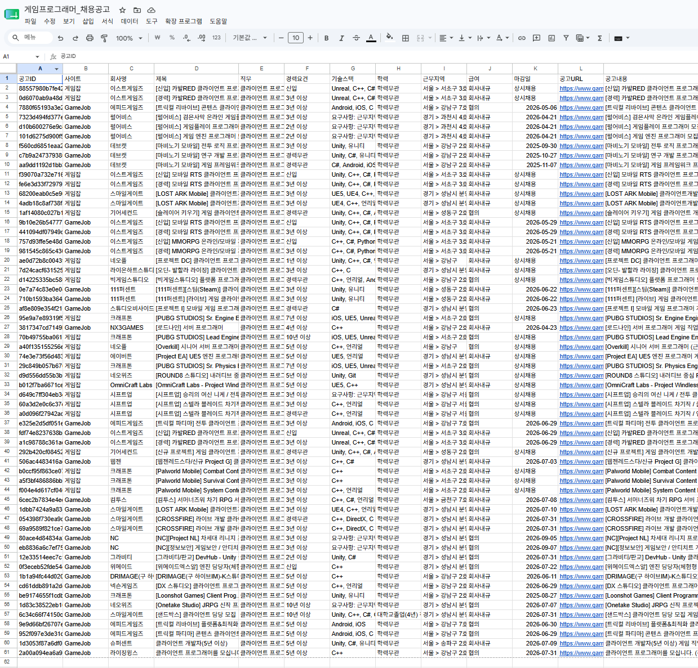
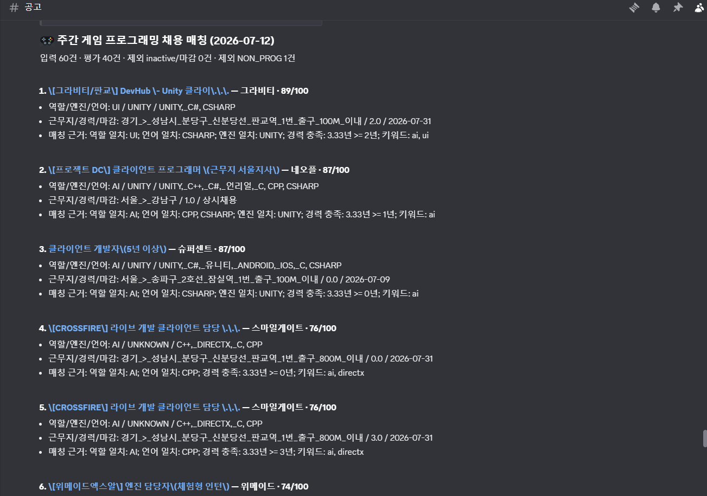

Hermes Game Jobs Pipeline은 제가 게임 클라이언트 프로그래머 경력과 맞는 공개 공고를 검토할 때, 긴 자연어 공고에 흩어진 조건을 비교 가능한 근거로 바꾸기 위해 만든 자동화다. 결과는 지원 결론이 아니라 사람이 확인할 후보와 제외 사유다.

목표는 지원 여부를 대신 결정하거나 자동 지원하는 것이 아니다. 반복적인 공고 확인을 줄이고, 어떤 공고를 왜 검토해야 하는지에 필요한 정보를 같은 형식으로 준비하는 것이다.

## 사용자 흐름

1. Hermes 내부 Job Registry의 일간 수집 작업이 공개 채용 공고를 읽어 정규화된 행으로 저장한다.
2. 행은 출처, 직무, 기술, 상태처럼 비교 가능한 필드로 정리된다.
3. 주간 작업이 공개 프로필의 역할, 엔진, 언어, 기술 키워드와 공고 필드를 대조한다.
4. 마감 또는 비활성 공고와 프로그래밍 직무가 아닌 항목은 후보에서 제외한다.
5. 남은 후보는 역할·엔진·언어·경력 조건처럼 확인 가능한 근거와 함께 Discord에 전달된다.
6. 지원 여부와 최종 확인은 사람이 직접 결정한다.

_일간 수집 후 정규화된 공고 행을 운영 시트에서 확인한다._

## 구현 구조

채용 정보는 긴 자연어 목록으로 바로 비교하지 않는다. 수집 단계에서 행 단위로 저장해 이후 작업이 같은 필드를 기준으로 판단할 수 있게 한다.

- **일간 수집**: 공개 소스의 HTML, JSON-LD, 링크에서 공고를 추출한 뒤 URL을 정규화하고 안정 ID를 만든다. 중복 제거, 상세 페이지 보강, 마감·활성 상태 검증까지 마친 행만 운영 저장소와 스프레드시트에 동기화한다.
- **프로필 매니페스트**: 공개 가능한 역할, 엔진, 언어, 키워드만 별도 데이터로 유지한다.
- **주간 매칭**: 직무 적합성, 엔진·언어 일치, 경력·지역 조건, 키워드 신호를 근거로 검토 후보를 정리한다. 비게임·비개발·비활성·검증 부족·요구 경력 초과 항목은 제외 사유와 함께 걸러낸다.
- **Discord 전달**: 후보마다 링크와 매칭 근거를 안전하게 렌더링해 다음 행동을 빠르게 판단하게 한다.

## 운영 현황

2026-07-12 기준으로 일간 수집은 9개 공개 소스를 대상으로 동작하고, 검증된 활성 공고 60건을 운영 저장소에 유지했다. 일간 수집과 주간 매칭은 Hermes 내부 Job Registry에서 각각 별도 스케줄로 실행되며, 이 기록은 당시 두 작업이 정상 완료된 상태를 기준으로 한다.

이 구조는 [[hermes-daily-dev-brief]]와 마찬가지로 수집과 평가, 보고를 분리한다. 다만 대상은 기술 동향이 아니라 채용 공고이며, 결과도 정보 요약이 아니라 수동 지원 전의 검토 목록이다.

_주간 작업이 검토 후보와 매칭 근거를 Discord에 전달한다._

## 판단 경계

이 파이프라인은 후보를 좁히고 근거를 남기는 데만 사용한다.

- 로그인 세션, 브라우저 쿠키, 개인 지원 이력은 수집하거나 공개하지 않는다.
- 지원서 작성, 사이트 로그인, 지원 제출은 자동화하지 않는다.
- 추천 결과는 확정이 아니라 사람이 확인할 후보 목록이다.
- 프로필의 세부 경력 수치는 본문에서 상세히 다루지 않는다.
- 공고 상태가 불명확하거나 근거가 부족하면 높은 적합도로 단정하지 않는다.

## 포트폴리오 기준 의미

이 기능은 [[personal-hermes-agent]]의 Job Registry를 실제 반복 업무에 적용한 사례다. 단순히 공고를 모으는 데서 끝나지 않고, 정규화된 데이터, 공개 가능한 프로필 기준, 제외 규칙, 설명 가능한 매칭 근거, 사람의 최종 판단을 하나의 흐름으로 연결했다.

[[unreal-client-programming]]에서 쌓은 역할과 기술 경험은 매칭 기준의 입력으로만 사용한다. 개인 경력 정보를 그대로 노출하거나, 자동화 결과를 채용 판단의 결론으로 포장하지 않는다.
