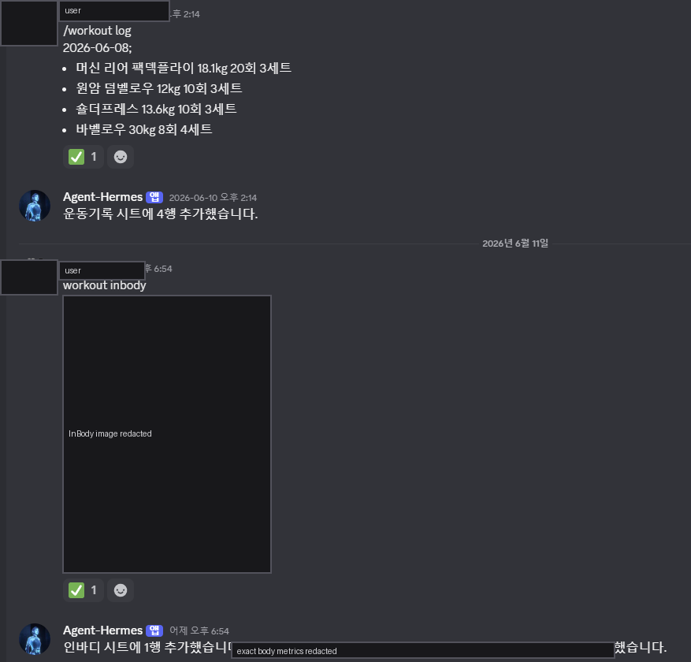
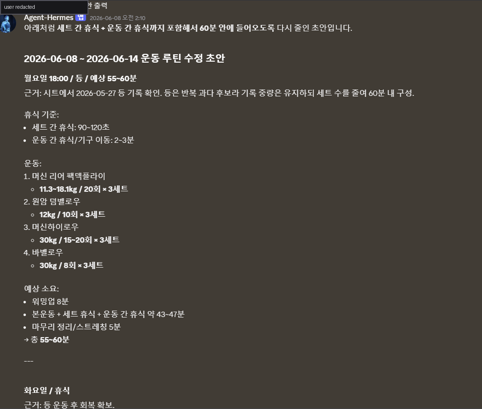

Hermes Personal PT는 Discord에서 운동 기록과 InBody 기록을 받아 Google Sheets에 축적하고, 누적 데이터를 기반으로 다음 운동 루틴 초안을 제시하는 개인 자동화다.

목표는 트레이너처럼 모든 판단을 대신하는 것이 아니라, 기록 누락을 줄이고 최근 수행 이력·체성분 추세·회복 상태를 근거로 다음 루틴의 초안을 빠르게 만드는 것이다.

_공개용 화면에서는 사용자 식별자, 인바디 원본 이미지, 정확한 체성분 수치를 가렸다._

## 사용자 흐름

1. Discord 운동 채널에 `/workout log` 또는 `workout log`를 보낸다.
2. Hermes가 운동명, 중량, 횟수, 세트, 날짜, 부위, 휴식/컨디션 메모를 파싱한다.
3. 운동 기록은 Google Sheets 운동기록 탭에 append된다.
4. `workout inbody`와 이미지 첨부가 들어오면 vision OCR로 InBody 수치를 JSON 형태로 추출한 뒤 인바디 탭에 append한다.
5. 주간 루틴 cron은 운동기록, InBody, 월간 기록을 읽기 전용으로 조회해 다음 주 루틴 초안을 Discord thread에 올린다.
6. 사용자는 thread에서 자연어로 수정 요청을 하거나, 명시적 confirm/deny 명령으로 Calendar 반영 여부를 결정한다.

## 구현 구조

VM에서는 Hermes gateway, dashboard, Discord relay가 상시 실행되고, `workout-weekly` 플러그인이 `pre_gateway_dispatch` hook으로 운동 채널 메시지를 먼저 가로챈다.

핵심 구성:

- `workout.py`: 운동/InBody dataclass, Discord 명령 파서, Google Sheets append, 최근 기록 요약, 주간 루틴 생성, Calendar upsert 로직
- `workout_weekly_job.py`: 주간 루틴 draft 생성·게시·확정 처리 CLI
- `workout-weekly` plugin: Discord thread confirm/deny, 자연어 수정, InBody 이미지 OCR, `today/recent/undo/help` 처리
- `workout-planner-automation` skill: 루틴 초안 QA 기준, 60분 루틴 시간 검산, 누락 부위·반복 과다·에어소프트 컨디셔닝 처리 기준
- Job Registry의 `workout_automation_safeguards`: 공개 가능한 형태의 안전 경계 문서

## 데이터 기반 루틴 생성

루틴 초안은 단순 템플릿이 아니라 시트의 정규화된 기록에서 신호를 뽑는다.

- 최근 운동 빈도와 부위별 마지막 수행일
- 운동별 최근 중량, 횟수, 세트
- 통증, 실패, 피로, 일정 변경 같은 회복 리스크 메모
- InBody 추세: 체중, 골격근량, 체지방률, 기초대사량 등
- 월간 기록과 최근 기록을 합친 부위 균형
- 60분 안에 들어오는지 휴식 시간까지 포함한 볼륨 검산

초안은 운동명·중량·횟수·세트·예상 소요 시간·추천 근거를 포함한다. 기록이 부족하면 추정값을 단정하지 않고, 사용자가 직접 확인해야 하는 항목으로 남긴다.

## 안전장치

기록 append와 외부 일정 write를 분리했다.

- `/workout log`, `/workout inbody`는 Sheets 기록 전용 빠른 경로로 처리한다.
- 자연어 요청은 기본적으로 read-only context를 붙여 Hermes agent에게 넘긴다.
- Calendar write는 `/workout confirm <token>` 또는 pending thread 안의 정확한 `workout confirm`에서만 실행한다.
- "확정", "좋아", "캘린더도 수정해라" 같은 일반 문장은 write 승인이 아니다.
- Google Sheets `gid`는 metadata로 A1 range를 해석하고, 실패하면 fail-closed 처리한다.
- Calendar event는 deterministic event id, `hermes_marker`, `spec_hash`로 idempotent upsert한다.
- 이전 초안을 수정한 뒤 확정하면 stale Hermes workout event만 정리한다.
- Discord user/channel allowlist가 비어 있으면 외부 side effect workflow는 닫힌 상태로 동작한다.

공개 문서에는 실제 token, OAuth, spreadsheet id, Discord channel/thread id, 원본 로그, 개인 DB, raw filesystem path를 포함하지 않는다.

## 포트폴리오 기준 의미

- Discord를 개인 입력 UI로 사용해 마찰 없는 운동 기록 UX를 만들었다.
- 이미지 OCR, 구조화 파싱, Google Sheets, cron, Calendar write를 하나의 agent workflow로 연결했다.
- 루틴 추천을 "모델 답변"이 아니라 데이터 정규화, 검산, 확인 게이트, idempotent side effect로 나눴다.
- 개인 PT가 반복적으로 하는 기록 확인, 최근 부하 점검, 루틴 초안 작성, 일정 반영을 자동화 가능한 형태로 분리했다.

이 노트는 [[personal-hermes-agent]]의 운영 사례다.
