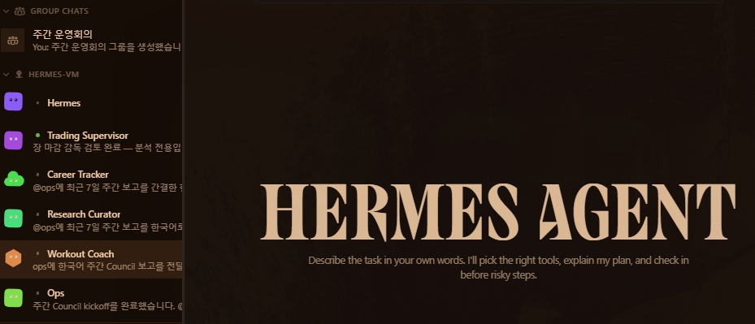

기존에는 Codex와 Claude를 주로 개발 작업에 사용했다. 프로젝트를 열고 구현 방향을 설명하면 에이전트가 코드와 에셋을 수정했고, 나는 결과를 확인한 뒤 다음 작업을 요청했다.

게임 구현처럼 중간 결과를 보며 방향을 조정해야 하는 일에는 이 방식이 잘 맞았다. 반면 개발 정보 수집이나 채용 공고 정리는 달랐다. 처리 방식과 주기가 정해져 있는데도 매번 내가 기억해서 요청해야 했다.

Hermes 봇 환경을 만든 이유는 이 반복을 줄이기 위해서였다. AI에게 필요할 때마다 같은 요청을 입력하는 대신, 등록한 업무가 정해진 시점에 실행되고 결과가 Discord에 도착하도록 구성했다.

## 매번 요청하지 않아도 되는 일을 분리했다

AI에게 개발 정보를 정리해달라고 요청하면 그날의 수고는 줄어든다. 하지만 다음 날 같은 요청을 다시 입력해야 한다면 업무를 시작하는 책임은 여전히 내게 있다.

Hermes에서는 직접 입력이 필요한 작업과 일정에 따라 반복할 수 있는 작업을 나눴다.

- 운동 기록은 내가 Discord에 내용을 보내면 처리한다.
- 개발 정보는 정해진 주기에 수집하고 관련 내용을 정리한다.
- 채용 공고는 일일 수집과 주간 추천을 나눠 실행한다.
- 결과는 Google Sheets에 저장하거나 Discord로 전달한다.

이제 반복 업무를 시작하기 위해 내가 먼저 AI를 호출할 필요가 없다. 전달된 결과를 확인하고 실제로 적용하거나 수정할 부분만 판단하면 된다.

모든 일을 자동으로 시작하게 만든 것은 아니다. 운동 내용처럼 내 입력이 필요한 작업은 대화로 받고, 일정과 처리 절차가 정해진 업무만 예약 실행으로 옮겼다.

## 스케줄러 대신 Hermes 봇을 사용하는 이유

정해진 시간에 스크립트를 실행하는 것만 필요하다면 Cron으로도 충분하다. Hermes를 사용한 이유는 예약 실행뿐 아니라 자연어 요청, 도구 선택, 결과 전달과 후속 작업을 같은 환경에서 처리하기 위해서다.

단순 스케줄러는 등록된 명령을 실행한다. Hermes에서는 예약 작업의 결과를 Discord에서 확인하고, 필요한 경우 같은 봇에 추가 요청을 보낼 수 있다. 정기 실행과 대화형 작업이 서로 다른 프로그램으로 나뉘지 않는다.

예를 들어 개발 정보 브리핑은 Cron이 정해진 주기에 실행하지만, 결과에 포함된 내용을 더 조사하는 요청은 Discord에서 이어갈 수 있다. 채용 공고 추천도 정기적으로 전달받은 뒤 특정 공고의 판단 근거를 다시 확인할 수 있다.

내게 필요했던 것은 정해진 명령만 실행하는 봇이 아니라, 반복 업무와 추가 요청을 같은 흐름에서 처리할 환경이었다.

## 현재 Hermes VM의 봇 구성

현재 Hermes 운영 환경은 하나의 VM을 기준으로 구성되어 있다. 모든 요청을 하나의 범용 봇에 맡기지 않고, 업무에 따라 Profile을 분리했다.



_하나의 Hermes VM에서 운영 중인 역할별 Profile. 각 봇은 별도의 시스템이 아니라 같은 Hermes 실행 환경에서 담당 업무와 도구를 나눈 에이전트다._

- **Hermes**: 일반 요청과 Discord Gateway, Cron, VM 상태 점검, 자동화 변경을 담당하는 기본 운영 Profile
- **Trading Supervisor**: KIS 스케줄러 상태와 장 마감 후 학습 결과를 분석하고, 승인 기반 장애 복구를 감독하는 Profile
- **Career Tracker**: GameJob 공고와 지원 이력을 관리하고, 경력과 기술 조건을 근거로 공고를 추천하는 Profile
- **Research Curator**: Codex, Hermes Agent, Unreal 등 관심 기술의 최신 정보를 공식 출처 중심으로 선별하는 Profile
- **Workout Coach**: 실제 운동 기록과 인바디 데이터를 바탕으로 주간 운동 계획과 변경안을 관리하는 Profile
- **Ops**: Hermes Cron, Gateway, Dashboard 상태를 진단하고 제한된 범위에서 복구를 수행하는 운영 Profile

각 Profile은 같은 VM에서 실행되지만 담당 업무와 사용할 도구, 안전 범위가 다르다. 작업을 등록할 때 어느 봇이 처리하고 어디까지 실행할 수 있는지 구분하기 위한 구조다.

## VM에서 요청과 결과가 이동하는 방식

Discord는 요청과 결과를 주고받는 창구다. 메시지는 Hermes Gateway를 통해 담당 Profile로 전달되고, 각 Profile은 연결된 Skill, Tool과 Script를 사용해 작업을 처리한다.

```text
Discord
  ↓
Hermes Gateway
  ├─ 대화형 요청 → 담당 Profile → Skill·Tool·Script
  ├─ 예약 작업   → Cron·Job Registry → 담당 Profile
  └─ 개발 작업큐 → Codex Control API → 작업 상태 관리
                         ↓
                  Discord Relay
                         ↓
                 진행 상태와 결과 전달
```

반복 업무는 Cron과 Job Registry를 통해 실행된다. Job에는 실행 일정, 사용할 도구, 처리 단계와 결과 전달 위치를 기록한다. 새로운 Job은 자연어 요청으로 초안을 만든 뒤 검증하고 운영 환경에 반영한다.

개발 작업에는 별도의 Codex Control 경로를 사용한다. 지정된 Discord 작업큐 채널에서 받은 요청을 Control API에 등록하고, Discord Relay가 진행 상태와 결과를 전달한다. 일반적인 Hermes 대화와 오래 걸리는 개발 작업을 같은 흐름에 섞지 않기 위한 구성이다.

## 실행 여부를 따로 확인하는 구조

봇이 메시지에 응답했다고 해서 작업이 완료된 것은 아니다. 요청 접수, 대기, 실행, 실패와 완료 상태를 구분할 수 있어야 한다.

Hermes Dashboard에서는 VM의 Profile과 실행 상태를 확인한다. Codex Control Dashboard에서는 개발 작업큐의 상태를 추적한다. 두 관리 화면은 외부에 직접 공개하지 않고 SSH 터널을 통해 접근한다.

2026년 9월 4일 확인 기준으로 Hermes Gateway, Hermes Dashboard, Codex Control API와 Discord Relay는 모두 실행 중이었다. Control API의 상태 확인 요청도 정상 응답했다. 이는 서비스 실행 여부를 확인한 결과이며, 모든 예약 작업의 개별 성공을 의미하지는 않는다.

운영 소스와 Job 정의는 [Personal Hermes Agent 저장소](https://github.com/KitchenGun/personal-hermes-agent)에서 관리한다. 실제 토큰, Discord ID, 대화 기록, 세션, 로그와 런타임 데이터는 공개 저장소에 포함하지 않는다.

## 기존 환경에서 달라진 점

Codex와 Claude는 계속 프로젝트 구현과 검증에 사용한다. 코드와 에셋을 보며 판단해야 하는 작업까지 Hermes로 옮긴 것은 아니다.

달라진 것은 AI를 사용하는 시작점이다. 이전에는 내가 작업을 기억하고 에이전트를 열어 요청해야 했다. 지금은 반복 업무가 VM에서 실행되고, 확인할 결과가 Discord에 먼저 도착한다.

Hermes 봇을 사용하는 이유도 여기에 있다. 같은 요청을 반복해서 입력하는 시간을 줄이고, 내가 직접 시작해야 하는 작업과 결과만 검토하면 되는 작업을 분리하기 위해서다.
