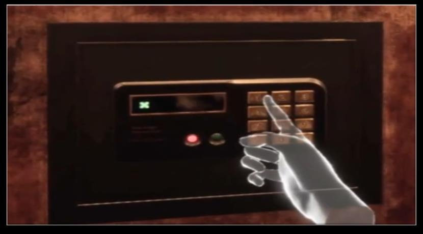
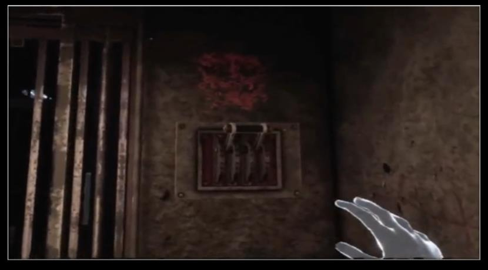

반복되는 퍼즐 기믹은 상속보다 컴포넌트와 인터페이스로 분리하는 편이 재사용성이 높다.

포트폴리오 기준 경험:

- 상호작용 객체의 공통 로직을 컴포넌트화
- Interface 기반 상호작용 설계
- 어떤 Actor에도 부착 가능한 상호작용 핵심 로직 구현
- 다이얼, 레버, 자물쇠, 키패드 같은 반복 기믹 모듈화
- 신규 퍼즐 제작 시 코드 수정 없이 조립만으로 구현 가능한 환경 구축

목표는 기믹을 빠르게 늘리는 것이 아니라, 기획 변경에도 안정적으로 조립 가능한 구조를 만드는 것이다.

포트폴리오에서는 다이얼, 레버, 자물쇠, 키패드처럼 반복되는 퍼즐 기믹을 동일한 컴포넌트와 인터페이스 구조로 구현해 신규 기믹 제작 시간을 줄인 사례를 확인할 수 있습니다.

관련 노트: [[unreal-client-programming]], [[inventory-system]]
