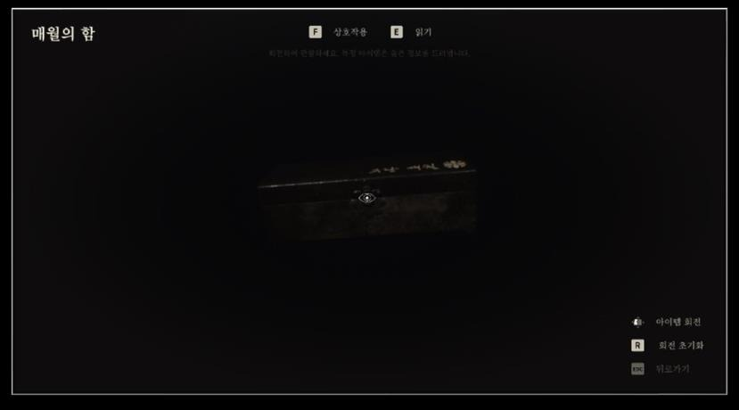

저는 인벤토리를 단순 목록 UI가 아니라 데이터, 입력, 조사 연출이 한 흐름으로 만나는 클라이언트 시스템으로 설계했다. 아이템을 추가하거나 표현을 바꿀 때 UI와 게임 로직이 함께 흔들리지 않도록 데이터 구조를 먼저 분리했다.

포트폴리오 기준 경험:

- Grid Panel 기반 인벤토리 UI 레이아웃
- GI Subsystem과 DataTable로 아이템 정보 관리
- 360도로 돌려보는 3D 아이템 조사 기능
- 관성 물리 효과를 포함한 아이템 조작감 구현
- 일시정지 상태에서도 보이스와 자막이 구동되는 로직
- 아이템 추가 시 코드 수정 없이 DataTable 추가로 대응 가능한 구조

인벤토리는 스토리 전달 장치가 될 수 있다. 특히 공포 게임에서는 조사 중 사운드·자막·상태 변화가 끊기지 않는 구조가 중요했다.

Ribbon Games에서는 타르코프 스타일 인벤토리 시스템을 개발했습니다. Unreal Data Asset과 DataTable 기반 아이템 데이터 테이블을 제작하고, 인벤토리 Widget·UI·주요 기능을 구현했습니다. 아이템 데이터를 별도로 관리해 UI와 기능이 일관되게 참조하도록 구성했으며, 소규모 개발팀과 협업해 시스템을 완성했습니다.

관련 노트: [[common-ui-workflow]], [[unreal-client-programming]]
