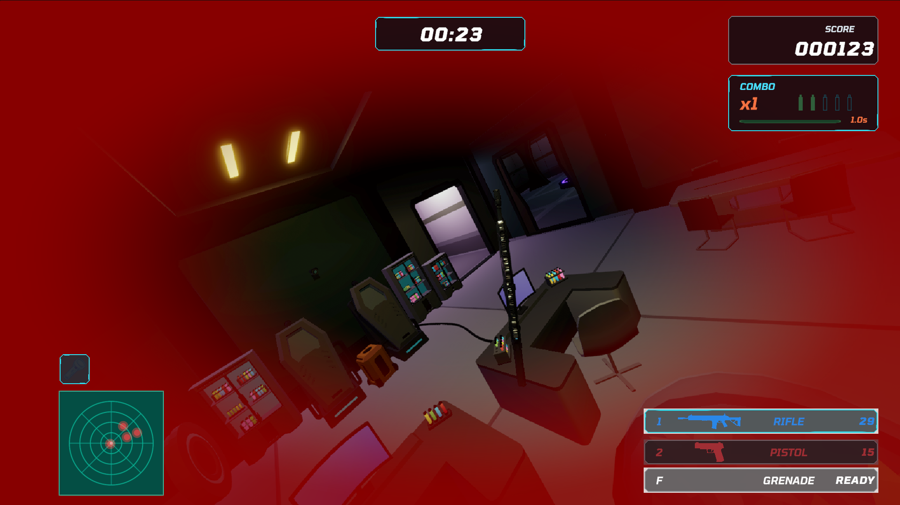

`LAST MAG`은 브라우저에서 바로 실행할 수 있는 Unity WebGL FPS다.

- [LAST MAG 실제 게임 플레이](https://kitchengun.github.io/wiki/games/last-mag/)
- [최종 대응 커밋 `4178cd7`](https://github.com/KitchenGun/LAST-MAG/commit/4178cd748d826db173279a977bbc352113112a59)

## 최초 문제 인식

고감도에서 마우스로 시점을 돌릴 때 화면이 간헐적으로 크게 튀었다. 폴링레이트가 1kHz 이상일수록 빈도가 증가했고, 4kHz 설정에서는 지속적으로 재현됐다.

문제는 단순한 감도 값이 아니라 브라우저부터 Unity Input System까지 이어지는 입력 경로에 있었다. Unity Input System은 고주파 마우스의 연속 이동 이벤트를 한 번의 Input Action 갱신으로 병합할 수 있으며, 이때 마우스 `delta`와 스크롤 값은 모든 이벤트의 합으로 누적된다. `Pointer.delta` 역시 한 프레임에 여러 이동 이벤트를 받으면 마지막 값으로 교체하지 않고 합산한다.

- [Unity InputSettings: 고주파 마우스 이벤트 병합과 delta 누적](https://docs.unity3d.com/ja/Packages/com.unity.inputsystem%401.4/api/UnityEngine.InputSystem.InputSettings.html)
- [Unity Pointer.delta: 프레임 내 이동값 누적](https://docs.unity3d.com/ja/Packages/com.unity.inputsystem%401.4/api/UnityEngine.InputSystem.Pointer.html)

Unity WebGL의 커서 잠금은 브라우저의 HTML5 `Element.requestPointerLock`을 사용한다. 따라서 WebGL에서는 브라우저가 전달한 이동값과 Unity의 프레임 단위 누적을 함께 고려해야 했다.

- [Unity Web 입력과 Pointer Lock](https://docs.unity3d.com/cn/current/Manual/webgl-input.html)

## 첫 번째 대응: 평활화와 픽셀 제한

[커밋 `500e2ca`](https://github.com/KitchenGun/LAST-MAG/commit/500e2ca)에서 다음 처리를 추가했다.

- 마우스 입력을 12ms 동안 평활화
- 한 프레임 입력을 최대 1200px로 제한
- 포인터 재잠금 직후 첫 입력을 무시

하지만 입력이 이미 비정상적으로 크게 합산된 뒤였다. 평활화는 잘못된 입력을 제거하지 않고 여러 프레임에 나눠 적용했기 때문에 근본적인 해결이 되지 못했다.

## 두 번째 대응: 각속도 제한

[커밋 `8a1f7fe`](https://github.com/KitchenGun/LAST-MAG/commit/8a1f7fe)와 [커밋 `7decf1a`](https://github.com/KitchenGun/LAST-MAG/commit/7decf1a)에서는 입력 경로와 진단 기준을 정리했다.

- 입력 바인딩을 `<Pointer>/delta`에서 `<Mouse>/delta`로 명확히 분리
- 평활화를 제거해 정상적인 마우스 감각 복원
- 최대 회전 속도를 `7200도/s`로 제한
- Development 진단 로그 추가
- 프리팹에도 제한값 `7200` 직렬화

여기에서도 비정상 입력 자체는 남아 있었다. 큰 입력을 삭제하지 않고 `7200도/s`로 축소해 적용했기 때문에 오류 샘플은 여전히 최대 속도 회전으로 나타났다.

## 최종 대응: Raw Pointer Lock과 스파이크 필터링

[커밋 `4178cd7`](https://github.com/KitchenGun/LAST-MAG/commit/4178cd748d826db173279a977bbc352113112a59), WebGL `0.1.22`에서 입력 경계를 브라우저와 게임 코드 양쪽에 만들었다.

`RawPointerLock.jslib`은 WebGL Canvas의 `requestPointerLock`을 감싸고 브라우저에 `{ unadjustedMovement: true }`를 요청한다. 이 옵션은 운영체제의 마우스 가속이 적용되지 않은 raw 이동값을 요청한다. 지원하지 않는 브라우저에서는 일반 Pointer Lock으로 다시 요청한다.

- [MDN Pointer Lock API: `unadjustedMovement`와 폴백](https://developer.mozilla.org/en-US/docs/Web/API/Pointer_Lock_API)
- [W3C Pointer Lock 2.0: raw movement 정의](https://www.w3.org/TR/pointerlock-2/)

게임 코드에서는 다음 원칙을 적용했다.

- Unity Input System의 고빈도 중복 이벤트 병합 유지
- 마우스 `delta`에 프레임 시간 보정을 적용하지 않음
- 포인터 재잠금 직후 첫 입력 폐기
- `7200도/s`를 초과한 샘플은 제한값으로 바꾸지 않고 완전히 필터링
- 정상 범위 입력은 평활화나 보정 없이 그대로 적용

전체 흐름은 다음과 같다.

```text
브라우저 Raw 입력
  -> Unity 이벤트 병합
  -> 정상 delta 그대로 적용
  -> 비정상 합산 스파이크만 필터링
```

관련 구현은 `FirstPersonController.cs`, `RawPointerLock.jslib`, `PlayerInputActions.inputactions`에 나뉘어 있다. 브라우저 입력 요청, Unity Action 바인딩, 실제 회전 적용과 진단을 각각 분리해 어느 구간에서 값이 바뀌는지 확인할 수 있게 했다.



_WebGL 0.1.22의 현재 인게임 화면. 이 이미지는 플레이 결과이며 4kHz 하드웨어 검증 증거는 아니다._

## 진단 로그와 검증

현재 진단 로그의 한 구간은 다음과 같았다.

```text
maxDelta=730.94px raw=586deg/s applied=586deg/s spikeDrops=0
```

이 구간에서는 입력이 제한 기준을 넘지 않았고, `raw`와 `applied`가 같아 정상 입력이 보정 없이 적용됐다. `spikeDrops=0`은 이 구간에서 필터링된 비정상 샘플이 없었다는 뜻이다.

정상 입력의 프레임레이트 의존성도 확인했다. 같은 마우스 이동을 30, 60, 144, 500FPS 조건으로 계산했을 때 프레임 시간 보정 없이 동일한 회전 결과가 유지됐고, 비정상 샘플을 버린 다음 정상 샘플은 다시 적용됐다.

현재 확인 범위는 다음과 같다.

| 항목 | 결과 |
| --- | --- |
| 원인에 맞춘 입력 경로 구현 | PASS |
| Unity 컴파일 | PASS |
| WebGL 0.1.22 빌드와 배포 | PASS |
| 4kHz 실제 하드웨어 장시간 플레이 | `not_run` |

[공개된 LAST MAG WebGL 빌드](https://kitchengun.github.io/wiki/games/last-mag/)에서 현재 플레이 버전을 직접 실행할 수 있다.

## 경계

이번 대응은 4kHz 이벤트를 모두 개별 처리하는 방식이 아니다. Unity의 이벤트 병합은 유지하되 브라우저 단계에서 raw 입력을 요청하고, 게임 코드에서는 정상 합산값과 비정상 스파이크를 구분한다.

코드, 컴파일, WebGL 배포와 진단 경로는 확인했다. 다만 첨부 화면과 현재 로그만으로 4kHz 마우스에서 장시간 튐이 완전히 사라졌다고 단정할 수는 없다. 최종 성능 판단은 실제 4kHz 하드웨어로 장시간 플레이한 뒤 별도로 확정한다.
