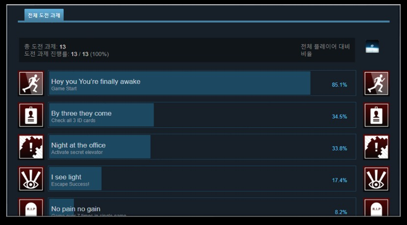

저는 Steamworks 작업을 게임 기능과 출시 운영이 만나는 클라이언트 책임으로 다뤘다. 업적 API가 동작하는지뿐 아니라 Depot 구성과 빌드 업로드 상태까지 확인해야 실제 출시 흐름이 완성된다고 보았다.

포트폴리오 기준 공개 가능한 경험:

- Steamworks SDK 프로젝트 통합
- Steam 도전과제 구현
- 도전과제 등록과 API 호출
- 도전과제 갱신 문제 반복 검증
- Depot 관리
- 빌드 업데이트와 업로드
- 출시 후 빌드 운영 대응

Steam 연동은 코드 구현만으로 끝나지 않는다. 빌드 파이프라인, 업적 ID, Depot 구성, 테스트 계정, 배포 상태를 함께 확인해야 한다.

Forbidden Art에서는 Steamworks SDK를 프로젝트에 통합하고 도전과제 API와 Depot 빌드·업로드를 관리해 2024.03.25 Steam 출시까지 연결했습니다.

관련 노트: [[unreal-client-programming]]
