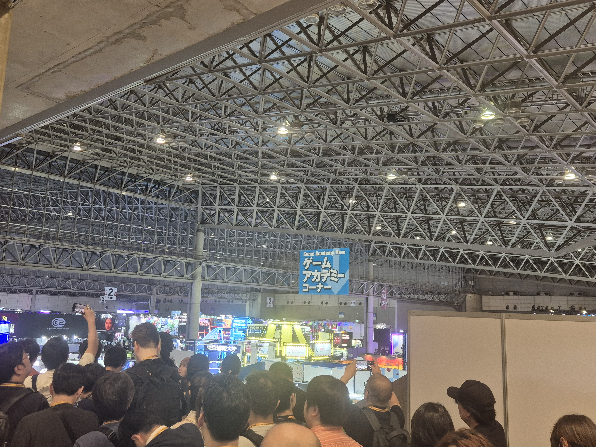
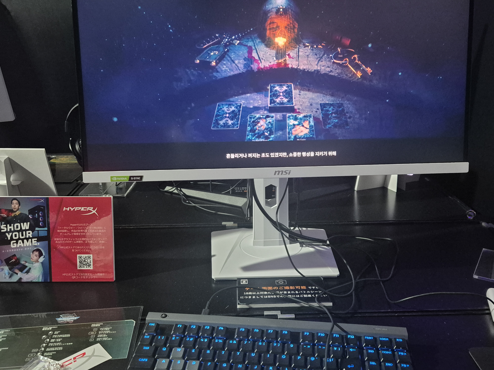
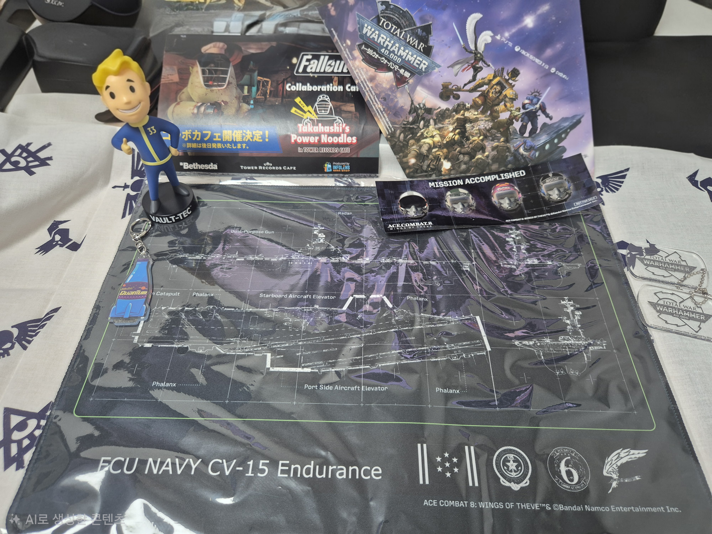
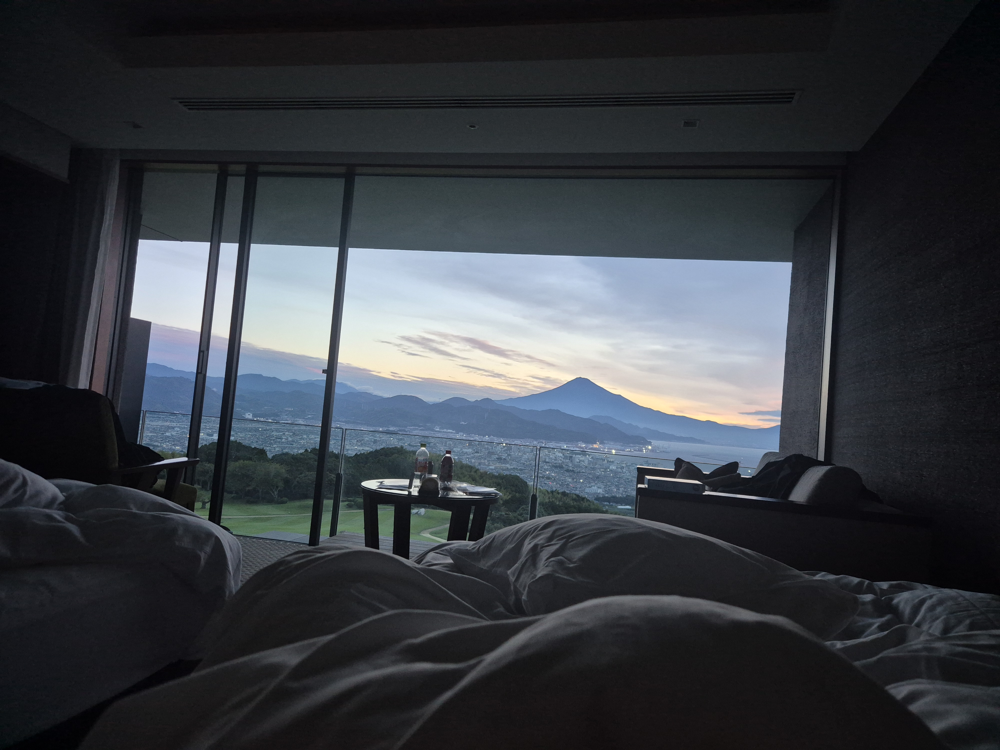
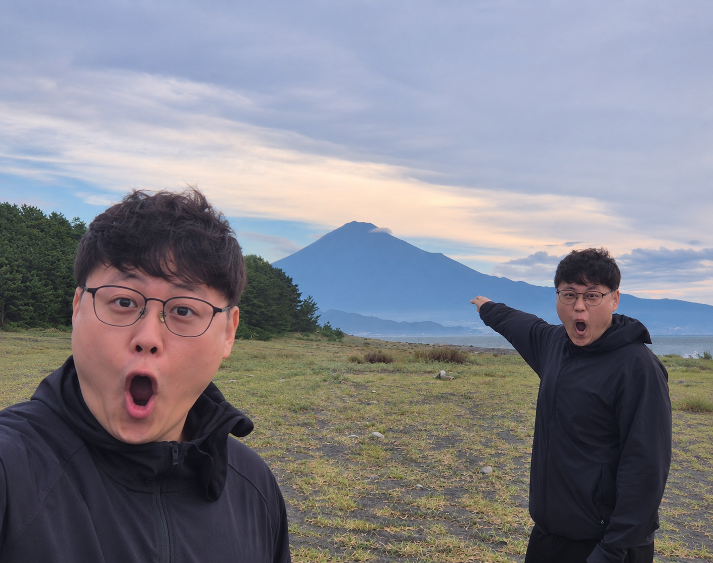

이번 주는 개발 기록 대신 도쿄 게임쇼와 일본 여행 이야기를 남긴다. TGS 2026에서 궁금했던 게임들을 직접 플레이하고, 행사 이후에는 시즈오카로 이동해 여행을 이어갔다.

현장에서는 워해머 토탈워, 에이스 컴뱃 8, 파레이돌리아, 아스트라에 오라티오를 플레이했다. 그중 워해머와 에이스 컴뱃 8은 직접 해보고 나니 구매하게 될 것 같다.

넥슨과 엔씨 부스의 시연도 해봤다. 평소 서브컬처 게임을 자주 하는 편은 아니지만, 이번에 플레이한 두 작품 중에서는 아스트라에 오라티오가 더 재미있었다. 짧은 시연에서 받은 인상이지만 완성도도 더 높게 느껴졌다.

굿즈는 원래 좋아하던 시리즈 위주로 골랐다. 폴아웃, 워해머, 에이스 컴뱃 굿즈를 구매했다. 목표로 했던 게임 시연도 해보고 원하던 굿즈도 챙긴 성공적인 일정이었다.

행사를 다녀온 뒤에는 시즈오카로 이동했다. 숙소에서 일어나니 창밖으로 후지산이 보였다.

후지산을 보다가 문득 [Two Soyjaks Pointing](https://knowyourmeme.com/memes/two-soyjaks-pointing) 밈이 떠올랐다. 이곳을 배경으로 재현해보면 재미있겠다는 생각이 들었다.

직접 촬영한 사진과 밈을 바탕으로 ChatGPT의 이미지 생성 기능을 활용해 인증샷을 만들었다. 평소에는 개발하면서 쓰던 AI를 이번에는 여행 사진에 써봤다.

