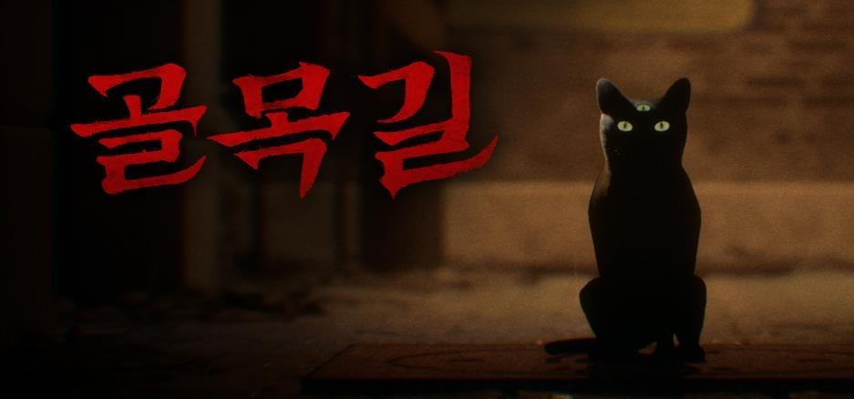

Unreal 클라이언트 프로그래밍의 핵심은 플레이어가 직접 만지는 시스템을 안정적으로 연결하는 일이다.

포트폴리오 기준 주요 경험:

- 콘텐츠/퍼즐 로직 구현
- 챌린지 모드와 핵심 퍼즐 로직 구현
- AI Behavior Tree, Blackboard, AI Perception, EQS
- Common UI 기반 UI 흐름
- Enhanced Input
- Custom GameUserSettings
- Steamworks 도전과제와 빌드 업로드
- DLSS/FSR, Virtual Texture 옵션
- Grid 기반 인벤토리와 3D 아이템 조사
- Interface 기반 상호작용 아키텍처
- String Table, Font Family, 언어별 에셋 현지화
- MetaSound, Attenuation, Sequencer

업무 과정에서는 GitHub Copilot 사내 도입을 추진하고, Claude Code를 활용해 코드 컨벤션을 검토하고 로직 최적화를 진행했다. 자연어로 Unreal Editor 작업을 수행하는 Unreal MCP 구현도 병행했다.

포트폴리오에 기록된 출시 프로젝트:

- Forbidden Art는 2024.03.25 Steam 출시, 골목길: 귀흔은 2025.10.29 출시 및 Smilegate 배급으로 이어졌습니다.
- Ribbon Games에서는 Unreal 클라이언트 프로그래머로 타르코프 스타일 인벤토리와 Data Asset/DataTable 기반 아이템 테이블을 구현했습니다.

관련 노트: [[unreal-ai-behavior-tree-eqs]], [[common-ui-workflow]], [[game-options-localization]], [[inventory-system]], [[interaction-component-architecture]], [[audio-visual-sequencer]], [[steamworks-integration]]
