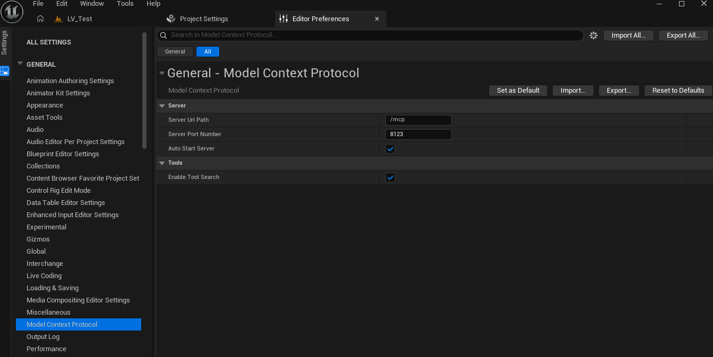
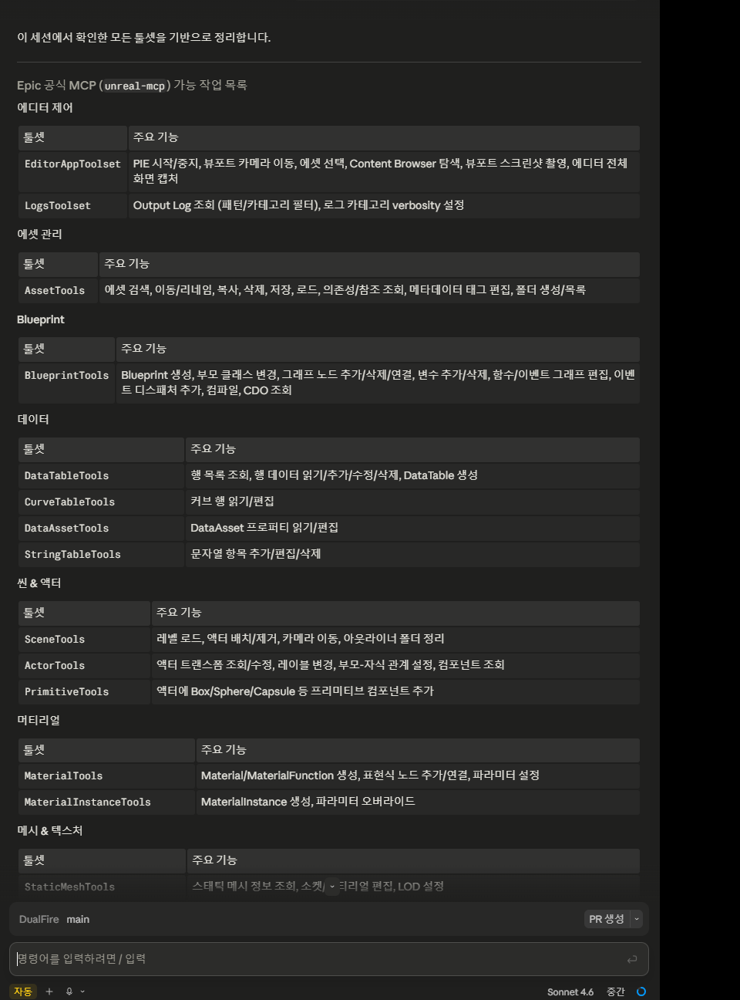
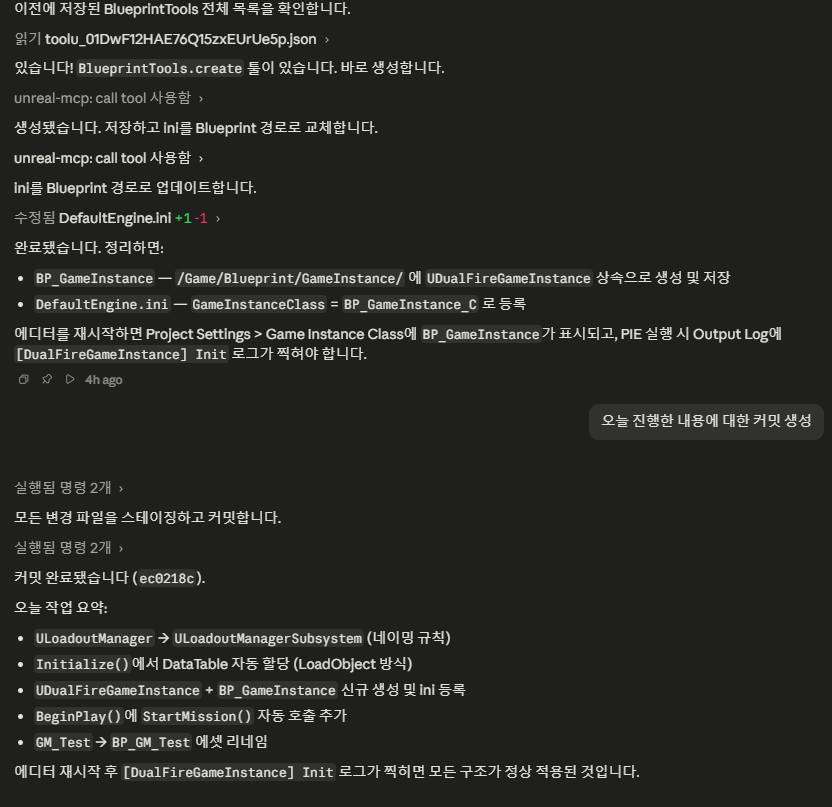

기존 커스텀 UnrealMCP 플러그인 중심 흐름을 정리하고, Unreal Engine 5.8의 공식 Model Context Protocol 플러그인과 EditorToolset을 DualFire 개발 루틴에 적용한 기록이다. 저는 단순 연결 데모가 아니라 실제 게임 초기화 구조를 수정하고 테스트하는 데까지 적용 범위를 잡았다.

이번 적용의 기준은 Epic의 Unreal Engine 5.8 업데이트와 Unreal MCP 공식 문서다.

- [Unreal Engine 5.8 is now available](https://www.unrealengine.com/news/unreal-engine-5-8-is-now-available)
- [Unreal MCP in Unreal Editor](https://dev.epicgames.com/documentation/unreal-engine/unreal-mcp-in-unreal-editor?lang=en-US)

## 적용 목표

- UE 5.8 전환 후 공식 `ModelContextProtocol` 플러그인을 사용한다.
- 프로젝트 전용 커스텀 MCP 플러그인 의존을 줄이고, 엔진 공식 MCP endpoint와 EditorToolset을 기준으로 정리한다.
- Claude 같은 MCP client에서 Unreal Editor의 Blueprint, Asset, DataTable, Actor, Scene 작업을 호출할 수 있게 한다.
- 실제 게임 구조 수정 작업에 MCP를 사용해 단순 연결 검증이 아니라 개발 루틴 검증까지 진행한다.

## 설정

DualFire는 UE 5.8 프로젝트로 전환했고 `.uproject`에서 `ModelContextProtocol`, `EditorToolset` 플러그인을 활성화했다. 기존 커스텀 UnrealMCP 플러그인은 제거하고, 범용 editor toolset은 별도 Python tool repo로 분리했다.



Editor Preferences의 Model Context Protocol 설정에서는 MCP server 경로, 포트, 자동 시작, tool search를 켰다. 공개 문서에서는 로컬 절대경로, client 설정 파일, 보안 토큰, tool UUID를 제외한다.

## Claude에서 확인한 공식 Toolset

Claude 세션에서 공식 `unreal-mcp`가 노출하는 toolset 목록을 확인했다. 확인한 범위는 에디터 제어, 에셋 관리, Blueprint, DataTable, Scene/Actor, Material, StaticMesh 계열이다.



주요 활용 범위:

- `EditorAppToolset`: PIE 시작/중지, 카메라 이동, Content Browser 탐색, 화면 캡처
- `LogsToolset`: Output Log 조회와 verbosity 설정
- `AssetTools`: 에셋 검색, 이동/리네임, 복사, 삭제, 저장, 로드
- `BlueprintTools`: Blueprint 생성, 부모 클래스 변경, 노드/변수/함수/이벤트 그래프 편집
- `DataTableTools`: 행 목록 조회, 행 데이터 읽기/추가/수정/삭제, DataTable 생성
- `SceneTools`, `ActorTools`: 레벨 로드, 액터 배치/제거, 트랜스폼 조회/수정, 컴포넌트 조회
- `MaterialTools`, `MaterialInstanceTools`: Material 생성, 노드 연결, MaterialInstance 파라미터 override

## 실제 해결 작업

공식 MCP 환경에서 Claude를 통해 DualFire의 로드아웃 초기화 구조를 정리했다.



작업 결과:

- `LoadoutManager`를 `LoadoutManagerSubsystem`으로 리네임해 UE subsystem 네이밍 규칙에 맞췄다.
- `Initialize()`에서 Ship/Shield DataTable을 자동 로드하도록 정리했다.
- `UDualFireGameInstance` C++ 클래스를 추가했다.
- `BP_GameInstance` Blueprint를 생성하고 `DefaultEngine.ini`의 `GameInstanceClass`에 등록했다.
- `BeginPlay()`에서 `StartMission()`을 자동 호출하고, `StartMission()`에서 `LoadoutManagerSubsystem`을 통해 플레이어에 로드아웃을 적용했다.
- 테스트 GameMode 에셋은 UE prefix 규칙에 맞춰 `BP_GM_Test` 기준으로 정리했다.

핵심 흐름은 다음과 같다.

```text
BeginPlay()
  -> StartMission()
  -> GameInstance.GetSubsystem<LoadoutManagerSubsystem>()
  -> ApplyToPlayer()
  -> WeaponComponent / HealthComponent에 DataTable 기반 로드아웃 적용
```

## 의미

이번 업데이트는 "AI가 Unreal Editor를 열 수 있다" 수준의 연결 검증이 아니다. UE 5.8 공식 MCP를 사용해 프로젝트 설정, Blueprint 생성, ini 등록, C++ 구조 정리, DataTable 기반 초기화 흐름까지 실제 게임 개발 작업에 적용하고 결과를 확인했다.

개인 [[unreal-mcp]] 흐름에서는 앞으로 커스텀 플러그인을 직접 유지하기보다, UE 공식 MCP endpoint와 필요한 프로젝트 전용 Python 초기화만 얇게 조합하는 방향이 더 유지보수하기 좋다.

## 공개 기준

공개 문서에는 다음 값을 포함하지 않는다.

- 로컬 절대 경로
- `.mcp.json`, `.claude/settings.local.json`의 세부 설정
- SecurityToken, OAuth, webhook, 개인 계정 정보
- MCP tool UUID와 임시 세션 파일명
- 개인 프로젝트의 미공개 전체 로그
