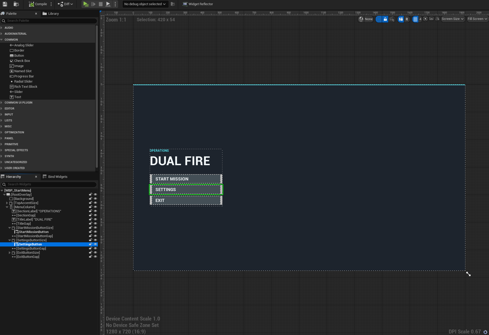
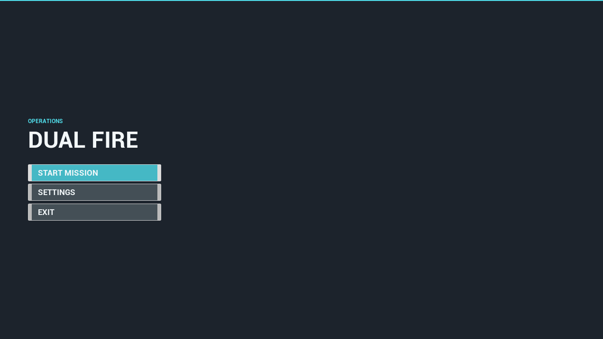

이번 작업은 새 MCP 서버를 만든 것이 아니다. DualFire의 UE 5.8 프로젝트 설정에는 Epic 공식 `UMGToolSet`, `MVVMToolset`, `PythonScriptPlugin`과 기존 `ModelContextProtocol`, `EditorToolset`이 활성화돼 있다. 이 환경에서 AI가 Widget Blueprint UI를 구성했으며, 이 글은 정적 설정과 WBP 자산, 바인딩, 컴파일 결과를 대조한 기록이다. 원본 MCP 호출 로그는 공개하지 않으므로, 실행 중인 Editor의 라이브 MCP 스키마나 원격 MCP 호출을 새로 증명하지는 않는다.

Epic은 UE 5.8에서 Unreal MCP와 UMG ToolSet을 Experimental 기능으로 제공한다. Unreal MCP는 Toolset Registry가 발견한 도구를 MCP Tool로 노출하는 구조이므로, 프로젝트에서는 필요한 Toolset을 명시적으로 활성화했다.

- [Unreal Engine 5.8 Release Notes](https://dev.epicgames.com/documentation/unreal-engine/unreal-engine-5-8-release-notes)
- [Unreal MCP in Unreal Editor](https://dev.epicgames.com/documentation/unreal-engine/unreal-mcp-in-unreal-editor)
- [UMG ToolSet API](https://dev.epicgames.com/documentation/unreal-engine/API/PluginIndex/UMGToolSet)

## 문제

UI 레퍼런스를 보고 Widget Blueprint를 만들 때는 Designer Tree, Widget/Slot 속성, Event Graph, 저장과 컴파일을 따로 다뤄야 한다. 화면만 보고 속성 이름을 추측하거나, Graph를 확인하지 않은 채 버튼을 배치하면 컴파일은 돼도 실제 동작과 C++ 바인딩이 어긋날 수 있다.

그래서 이번에는 WBP를 한 번에 생성하는 자동화보다 **트리 조회 -> 속성 확인 -> 변경 -> Graph 연결 -> 컴파일 -> 저장**의 검증 가능한 순서를 기준으로 잡았다.

## DualFire에 켠 공식 Toolset

`DualFire.uproject`에는 아래 플러그인이 모두 활성화돼 있다.

- `ModelContextProtocol`, `EditorToolset`
- `UMGToolSet`, `MVVMToolset`
- `PythonScriptPlugin`

`UMGToolSet`의 공개 호출 도구는 현재 UE 5.8 헤더 기준 23개다. 이 목록은 WBP 생성, Widget Tree 조회와 수정, Named Slot, UI Component, 이벤트 바인딩, 컴파일 범위를 보여 준다. 실제 AI client에서의 도구 노출과 호출 가능 여부는 Editor 재시작 뒤 MCP 스키마로 별도 확인해야 한다.

| 범위 | 대표 도구 | 이 작업에서의 역할 |
| --- | --- | --- |
| 생성 | `CreateWidgetBlueprint`, `AddWidget`, `SetNamedSlotContent` | WBP와 Widget Tree의 시작 구조를 만든다. |
| 조회 | `GetWidgets`, `GetNamedSlots`, `ListWidgetBlueprints`, `ListWidgetClasses`, `GetWidgetClassInfo` | 이름, 부모, Slot, 사용 가능한 클래스를 먼저 확인한다. |
| 수정 | `MoveWidget`, `RemoveWidget`, `RenameWidget`, `ToggleWidgetAsVariable`, `BindToEventProperty`, `WrapWidgets` | 계층·이름·이벤트·변수 노출을 정리한다. |
| 구조 보정 | `GetWidgetDescription`, `GetWidgetTreeDepth`, Widget 교체 도구 | 트리를 설명 가능한 텍스트로 보고, 패널·Named Slot·자식 교체를 수행한다. |
| 컴포넌트와 검증 | `AddUIComponent`, `RemoveUIComponent`, `MoveUIComponent`, `CompileWidgetBlueprint` | UI Component를 조정하고 WBP 오류를 확인한다. |

`ObjectTools`는 UMGToolSet이 돌려준 Widget, Slot, UI Component 참조의 속성을 다룬다. 속성을 수정할 때는 아래 순서로 정확한 이름과 타입을 먼저 확인한다.

```text
list_properties
  -> get_properties
  -> set_properties
```

Widget마다 속성 이름과 타입이 다르므로 텍스트, 색상, 패딩, 앵커, 정렬, 크기를 추측해서 쓰지 않는다.

`PythonScriptPlugin`과 기존 `EditorToolset`의 `BlueprintTools`는 Event Graph와 Function Graph, 변수, Event Dispatcher, 노드, 핀, 기본값, 부모 클래스, Blueprint 컴파일을 다루는 도구 범위다. 버튼 이벤트를 만들고 함수 호출 노드를 연결하는 단계까지 WBP 작업에 포함할 수 있지만, 이 글은 개별 런타임 호출 기록을 새로 주장하지 않는다.

`MVVMToolset`에는 `CreateViewModel`, `AddViewModelProperty`, `ListViewModels`, `ListWidgetViewModels`, `AddViewModelToWidget`, `ListWidgetViewBindings`, `CreateViewBinding`, `RemoveWidgetViewBinding`, `ListConversionFunctions`가 선언돼 있다. 이 목록은 WBP와 ViewModel Binding을 구성할 수 있는 정적 도구 범위를 보여 주며, 실제 Binding 실행은 별도 검증 항목이다.

## WBP_StartMenu의 구조와 실행 화면

WBP 직렬화와 Designer 스크린샷에서 `WBP_StartMenu`의 `RootOverlay`, 배경, 상단 Accent, 제목, 메뉴 Column, `StartMissionButton`, `SettingsButton`, `ExitButton`과 각 텍스트를 확인했다. AI가 Toolset을 이용해 구성한 결과는 이 자산 구조와 화면으로 확인하되, 개별 MCP 호출 원문은 공개하지 않는다.



_WBP Designer에서 확인한 시작 메뉴 구조. 선택한 `SettingsButton`을 포함한 이름과 계층은 C++의 `BindWidget` 대상과 일치해야 한다._

현재 C++은 세 버튼을 `BindWidget`으로 받고 각각 `StartMission`, `OpenSettings`, `ExitGame`에 연결한다. 이는 WBP 이름과 C++ 이벤트 경계가 맞는다는 근거이며, UMG/MVVM MCP 호출이 이 구조를 생성했다는 직접 로그는 아니다.



_WBP_StartMenu 기반으로 확인한 시작 메뉴 실행 화면. 이 이미지는 결과 UI의 시각 근거이며, MCP 도구 호출 자체의 근거는 아니다._

저장 뒤의 `CompileAllBlueprints` 기록에서는 `WBP_MenuButton`, `WBP_Settings`, `WBP_StartMenu`이 컴파일됐고 전체 결과는 오류 0건, 경고 0건, 로드 실패 0건이었다. `CompileWidgetBlueprint`는 컴파일만 하므로 변경 확정에는 별도로 `AssetTools.save_assets`를 호출한다. 현재 스냅샷의 PIE 재실행 결과를 이 글에서 새로 주장하지는 않는다.

## 권장 작업 순서

```text
WBP load
  -> GetWidgets로 대상 Widget/Slot 참조 확보
  -> list_properties로 정확한 속성 이름 확인
  -> AddWidget 또는 set_properties로 Designer 수정
  -> BlueprintTools로 Event Graph와 함수 호출 연결
  -> CompileWidgetBlueprint
  -> AssetTools.save_assets
```

위 순서는 헤더의 도구 범위와 WBP 자산 검증에 맞춘 권장 흐름이며, 실행한 MCP 호출의 원문 기록은 아니다. [[unreal-uasset-text-diff]]에서 변경을 텍스트 근거로 남기는 방식처럼 결과 화면만 보지 않고 Tree, 속성, Graph, 컴파일 결과를 각각 확인 가능한 입력으로 남기는 것이 목적이다. 기존 [[unreal-mcp-58-official-update]]가 공식 MCP 전환과 일반 Blueprint 작업을 다뤘다면, 이번 기록은 UI 제작에서 그 Toolset을 어떻게 조합할 수 있는지에 초점을 둔다.

## 가능성과 제한

UMG Toolset, ObjectTools, BlueprintTools, MVVMToolset을 함께 쓰면 레퍼런스 UI를 WBP 초안으로 옮기고, 속성을 검증하며, 이벤트와 ViewModel Binding까지 이어가는 루프를 만들 수 있다. 앞으로는 UI 변경을 Tree와 속성 단위로 비교하고, 반복적인 메뉴/설정 화면 작업의 검토 범위를 줄이는 데 활용할 수 있다.

다만 이 기능은 Experimental이다. Epic 문서에 따르면 Unreal MCP의 Tool 호출은 게임 스레드에서 직렬 실행되므로, 연결된 AI client가 겹치는 호출을 동시에 보내지 않도록 작업을 순서화해야 한다. 이 동작은 이번 글에서 새로 런타임 검증하지 않았다. 또한 현재 확인한 공식 `UMGToolSet`에는 WBP Animation 타임라인의 애니메이션 생성, 트랙, 키프레임을 편집하는 전용 공개 도구가 없다. 그 영역까지 자동화하려면 별도 Widget Animation Toolset과 검증 경계를 추가해야 한다.

이 글은 로컬 프로젝트의 플러그인 설정, 현재 WBP 자산 구조, 저장 뒤의 Blueprint 컴파일 기록, 첨부된 Designer/실행 화면을 기준으로 한다. 따라서 실행 중인 Editor의 MCP 스키마 노출과 원격 MCP 사용은 검증하지 않았고, AI의 도구 호출 원문은 공개 범위에 포함하지 않는다.
