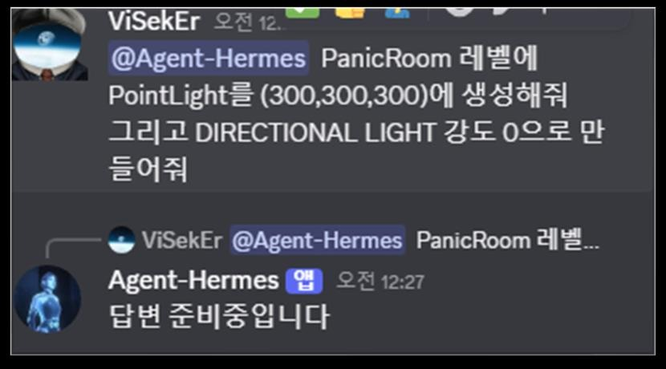
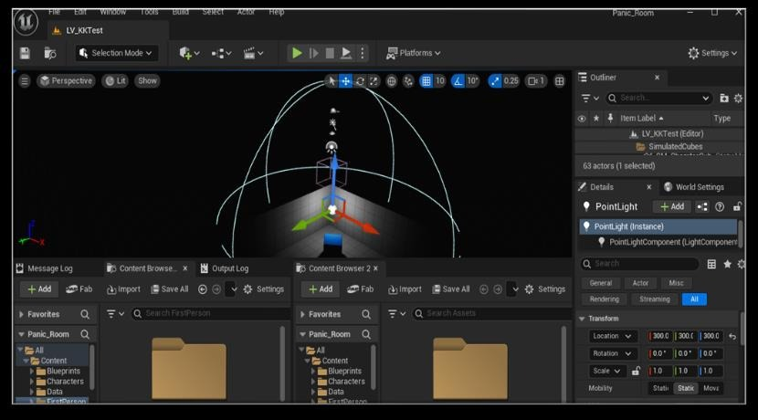

UnrealMCP는 제가 Unreal Editor의 반복 작업을 AI 도구와 연결하면서, 자동화해도 되는 작업과 사람이 확인해야 하는 작업을 구분하기 위해 진행한 개인 R&D다. 클라이언트 개발에서 쌓은 에셋·Blueprint·DataTable 작업 경험을 바탕으로 실제 에디터 흐름을 작은 단위로 검증했다.

포트폴리오 기준 목표:

- MCP와 Claude Skill을 사용한 Unreal 제어
- Blueprint, Animation, DataTable 같은 에디터 작업 자동화
- Unreal 전문 에이전트 구현
- GitHub Copilot 사내 도입 추진과 Claude Code 기반 코드 컨벤션 검토·로직 최적화 실험
- Discord bot을 통한 원격 작업 지시
- Hermes Agent로 자연어 요청을 작업 형태로 변환
- Claude Code, Open Code, Codex와 Unreal MCP 연동 실험
- UE 5.8 공식 Model Context Protocol 적용 사례인 [[unreal-mcp-58-official-update]]

포트폴리오에서는 Unreal MCP와 Discord bot을 연결해 자연어 요청을 Unreal Editor 작업으로 전달하고, 원격 환경에서 조명과 에셋 작업을 수행한 흐름을 확인할 수 있습니다. 공개 기록에는 실제 환경 정보와 인증값을 남기지 않았습니다.

이 주제는 [[unreal-client-programming]]과 연결된다. 클라이언트 개발 경험이 있어야 자동화 대상과 위험한 작업을 구분할 수 있다. [[hermes-daily-dev-brief]]는 Unreal/MCP 생태계 변화를 작업 전 리서치 맥락으로 공급한다.
