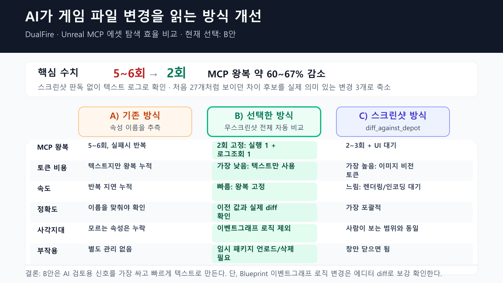

이 작업은 제가 AI 도구와 Unreal 프로젝트를 함께 검토할 때, `.uasset` 변경 근거가 화면 캡처에만 남는 문제를 해결하기 위해 만든 도구다. 핵심은 **AI가 Unreal 게임 제작 파일의 변경 내용을 텍스트로 읽을 수 있게 만드는 것**이다.

게임을 만들 때 캐릭터, 카메라, Blueprint 같은 설정은 Unreal 전용 `.uasset` 파일에 저장된다. 문제는 이 파일이 GitHub에서 일반 문서처럼 보이지 않는다는 점이다. 파일이 바뀐 것은 알 수 있지만, 실제로 어떤 설정이 바뀌었는지는 바로 읽기 어렵다.

그래서 Codex/Hermes가 Unreal 프로젝트를 도와도, 에셋 변경을 확인하려면 사람이 에디터 화면을 열거나 스크린샷을 보고 판단해야 했다. 저는 그 확인 과정을 텍스트 기록으로 바꿔, 사람이 검토하는 근거와 AI가 읽는 입력을 같은 형태로 남기려 했다.

## What Changed

DualFire에 `Content/Python/uasset_diff.py`를 추가했다.

이 도구는 이전 버전의 게임 파일과 현재 게임 파일을 비교한 뒤, 바뀐 설정을 사람이 읽을 수 있는 텍스트 로그로 출력한다. 결과적으로 Codex/Hermes는 에디터 스크린샷 대신 텍스트 기록을 읽고 변경 내용을 판단할 수 있다.

비개발자 기준으로 보면 핵심은 다음과 같다.

- 이전 게임 파일과 현재 게임 파일을 비교한다.
- 바뀐 설정을 텍스트로 출력한다.
- 스크린샷 판독 없이 로그만 보고 변경 내용을 확인한다.
- 게임 에셋 변경도 코드 변경처럼 검토 가능한 기록으로 남긴다.

## Measured Improvement

측정은 BP_Test 조사 흐름을 기준으로 했다.



| 항목 | 기존 방식 | 개선 후 |
| --- | --- | --- |
| 확인 왕복 | 5~6회 | 2회 |
| 개선폭 | - | 약 60~67% 감소 |
| 스크린샷 판독 | 필요 | 불필요 |
| 차이 후보 | 처음 27개처럼 보임 | 실제 의미 있는 변경 3개로 축소 |

기존에는 속성 이름을 추측해 여러 번 조회하거나, 에디터 diff 화면을 스크린샷으로 읽어야 했다. BP_Test 조사 기준으로 5~6회 왕복하던 흐름이 개선 후에는 실행 1회와 로그 조회 1회, 총 2회로 줄었다.

## Why It Matters

이 작업은 `.uasset`을 완전히 텍스트 파일로 바꾸는 것이 아니다. 대신 리뷰에 필요한 신호를 안정적으로 뽑아내는 보조 도구다.

중요한 점은 AI 협업 방식이 달라진다는 것이다.

- "뭔가 바뀐 것 같다"가 아니라 "무엇이 바뀌었다"를 기록으로 남길 수 있다.
- Codex/Hermes가 이미지 대신 텍스트 로그를 읽고 판단할 수 있다.
- Unreal MCP로 에셋을 탐색할 때 반복 추측과 화면 판독이 줄어든다.
- 공개 리뷰에는 구조와 개선폭만 남기고, raw diff와 내부 에셋 정보는 private memory에 둘 수 있다.

## How It Works

내부 구현은 다음 흐름이다.

1. Git revision에서 이전 `.uasset` 파일을 임시 위치로 추출한다.
2. Unreal Editor Python에서 이전 에셋과 현재 에셋을 각각 로드한다.
3. Blueprint 기본값과 컴포넌트 구성을 비교한다.
4. 메모리 주소처럼 매번 달라지는 값은 제거하고, 실제 의미 있는 값만 비교한다.
5. 결과를 텍스트 로그로 남긴다.

이 흐름 덕분에 사람이 눈으로 에디터 diff 창을 읽지 않아도, AI가 검토 가능한 입력을 얻을 수 있다.

## Image Suggestion

이 내용을 SNS나 발표 자료로 설명할 때는 코드 캡처보다 숫자 카드가 적합하다.

```text
AI가 게임 파일 변경을 읽는 방식 개선

Before
- 사람이 화면 확인
- 속성 이름 추측
- MCP 왕복 5~6회
- 스크린샷 판독 필요

After
- 텍스트 로그로 확인
- 실행 1회 + 로그 조회 1회
- 총 2회
- 약 60~67% 왕복 감소
```

하단에는 `Unreal 에셋 변경을 Codex/Hermes가 읽을 수 있는 기록으로 변환` 정도의 문구를 두면 충분하다.

## Limits

이 도구는 Blueprint 이벤트 그래프 노드 연결이나 복잡한 로직 변경을 직접 감지하지 못한다. 그런 변경이 중요할 때는 Unreal Editor의 내장 Blueprint diff 도구를 함께 확인해야 한다.

또한 공개 문서에는 구조, 판단 기준, 개선폭만 남긴다. 원본 에셋 경로, 내부 명명, raw diff 전문은 private memory에 유지하는 것이 맞다.

관련 노트: [[unreal-client-programming]], [[unreal-mcp]], [[interaction-component-architecture]]
